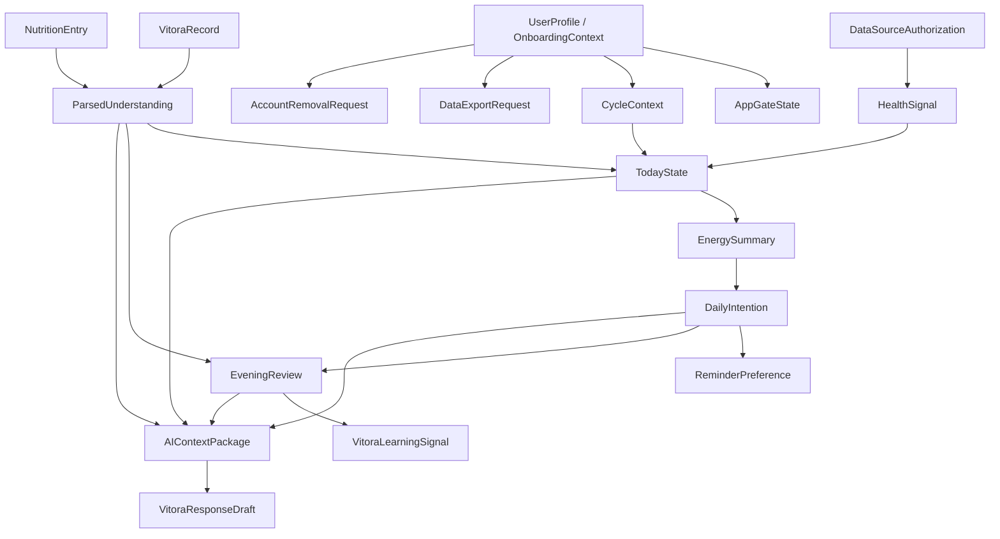

# Vitora Swift Rebuild · 数据 / 领域模型

> 规格集：`004-vitora-swift-rebuild`
> 批次：数据 / 领域模型
> 日期：2026-05-03
> 状态：当前生效

本文档定义 Swift 重建 P0 的领域对象、状态机、事件、数据生命周期、导出 / 删除 / AI 可用矩阵。本文不定义 SwiftData、Core Data、SQLite、CloudKit、接口端点、字段类型或实现任务。

---

## 0. 权威规则

| 规则 ID | 规则 | 约束 | 来源 |
| --- | --- | --- | --- |
| DMA-001 | `facts.md` 是最高事实来源。 | 本文若与 `facts.md` 冲突，先更新 `facts.md` 和 `decision-log.md`。 | F-SOURCE-001 |
| DMA-002 | 本文只承接 P0 产品能力。 | 不通过数据模型把延期功能带回 P0。 | F-P0-001, F-OUT-002 |
| DMA-003 | `data-privacy-ai-boundaries.md` 提供数据级别和隐私边界。 | 本文必须覆盖 `DC-00` 到 `DC-05`。 | DG-004 |
| DMA-004 | `spec.md` 提供需求来源。 | 每个 P0 数据对象必须能追溯到 `REQ-*`。 | SPA-002 |
| DMA-005 | `userflows.md` 和 `interaction-acceptance.md` 提供状态来源。 | 每个关键状态机必须服务至少一个 P0 流程或 `IAC-*` 验收项。 | UF-000, IAC-G-003 |
| DMA-006 | 当前 RN app 只作证据 / 反例证据。 | 不继承当前 Expo SQLite、Zustand、模拟 store 或 Alert 行为作为 Swift 目标。 | D-003, D-025 |
| DMA-007 | 本文是 `plan.md` 的输入，不是技术方案。 | 存储选型、加密实现、HealthKit 读取范围和 AI 适配层进入后续技术 batch。 | DG-003 |

---

## 1. 当前 App 数据证据

| 证据 ID | 来源 | 观察 | 对新模型的影响 |
| --- | --- | --- | --- |
| DM-EV-RN-001 | `src/shared/stores/*.ts` | 当前有用户、能量、A/B、周期、聊天、设备、成长、VIP 等 Zustand store，但多数是内存状态。 | 新模型不能把这些 store 当持久事实；只借鉴候选对象名。 |
| DM-EV-RN-002 | `src/shared/services/database/migrations.ts` | 当前 migration 定义旧表池，包含 P0 与延期对象混合。 | 新模型必须重新裁剪，不继承旧全量表池。 |
| DM-EV-RN-003 | `BodyAnalysisSheet.tsx` + A/B service | A/B service 有内存记录能力，但当前 Today 分析按钮只触发提示，没有接到 service。 | P0 必须定义 `DailyIntention`，并要求 UI 写入真实状态。 |
| DM-EV-RN-004 | `RecordPanel/index.tsx` + Vitora 输入栏 | 记录 sheet 和 Vitora 输入可打开、可输入，但多数动作停在提示或局部状态。 | P0 必须拆分 `VitoraRecord`、`ParsedUnderstanding`、`RecordConfirmation` 状态。 |
| DM-EV-RN-005 | `useFirstOpen.ts` | 首次能量仪式使用本地日期 key 控制。 | P0 需要 `DailyOpeningState`，但它属于 UI / derived 状态，不等于健康数据。 |
| DM-EV-RN-006 | `drawer/data-export.tsx`, `drawer/legal.tsx` | 导出和账号移除有页面与确认提示，但没有请求状态机。 | P0 必须定义 `DataExportRequest` 和 `AccountRemovalRequest`。 |
| DM-EV-RN-007 | `sanitizer.ts`, `safeLogger.ts` | 已有脱敏和日志保护意图，但 AI 上下文仍需产品层抽象。 | P0 必须定义 `AIContextPackage`，并由它约束 AI 输入。 |
| DM-EV-RN-008 | Simulator / `iosef` | 已定点确认 Today、Vitora、记录 sheet、导出、账号移除等动作仍缺少可承接状态。 | 新模型必须补齐“动作 → 状态 → 复盘 / 导出 / 删除”的数据闭环。 |

---

## 2. 数据级别映射

| 数据级别 | 本文覆盖对象 | 基本规则 |
| --- | --- | --- |
| DC-00 | `AppGateState`, `DailyOpeningState`, sheet / tab / gesture 状态 | 可不持久化；不得混入健康内容。 |
| DC-01 | `UserProfile`, `OnboardingContext`, `ReminderPreference` | 可导出、可删除；只服务个性化体验。 |
| DC-02 | `HealthSignal`, `CycleContext`, `NutritionEntry`, 手动记录原文 | 本地优先；进入 AI 前必须最小化。 |
| DC-03 | `DailyIntention`, `EveningReview`, `ParsedUnderstanding`, Vitora 学习信号 | 只服务学习循环，不做完成率或连续天数。 |
| DC-04 | `DataSourceAuthorization`, `DataExportRequest`, `AccountRemovalRequest` | 必须可达、可确认、可追踪状态。 |
| DC-05 | `AIContextPackage`, AI 输出草稿 | 临时、任务最小化、可重建；不作为长期核心数据。 |

---

## 3. 领域地图

核心判断：

- `TodayState` 是派生状态，不是用户直接录入的原始数据。
- `VitoraRecord` 是用户输入；`ParsedUnderstanding` 是 Vitora 对输入的可修正理解。
- `DailyIntention` 是 A/B 当日承诺，必须能被晚间复盘引用。
- `AIContextPackage` 是临时上下文包，不是长期事实库。
- 导出和账号移除必须覆盖 P0 内真实保存的数据，不只触发提示。

---

## 4. 领域对象清单

| 模型 ID | 名称 | 类型 | 用途 | 归属 | 创建来源 | 更新来源 | 持久性 | 可导出 | 可删除 | 可进 AI | 数据级别 | 关联需求 | 关联流程 | 数据规则 |
| --- | --- | --- | --- | --- | --- | --- | --- | --- | --- | --- | --- | --- | --- | --- |
| DM-001 | UserProfile | 实体 | 识别本地用户和偏好称呼。 | 用户 | Onboarding | Profile | 持久 | 是 | 是 | 仅称呼摘要 | DC-01 | REQ-001, REQ-002 | UF-001, UF-010 | DP-001, EX-003 |
| DM-002 | OnboardingContext | 实体 | 保存首日 Vitora 需要的最小上下文。 | 用户 | Onboarding | Profile / Vitora 记录 | 持久 | 是 | 是 | 摘要后可用 | DC-01, DC-02 | REQ-002, REQ-003 | UF-001, UF-002 | HK-004, DP-001 |
| DM-003 | AppGateState | 派生状态 | 决定进入 onboarding 还是 Today。 | App | 本地状态 | Onboarding 完成 / 账号移除 | 派生或轻持久 | 否 | 随账号移除 | 否 | DC-00 | REQ-001 | UF-001, UF-002 | EX-006 |
| DM-004 | DataSourceAuthorization | 实体 | 记录 HealthKit 授权、跳过、撤销和来源状态。 | 用户 | Onboarding / 轻抽屉 | 数据来源页 | 持久 | 是 | 是 | 仅类别摘要 | DC-04 | REQ-003, REQ-014 | UF-001, UF-010 | HK-001 到 HK-006 |
| DM-005 | HealthSignal | 实体 | 表示 P0 需要的健康相关输入。 | 用户 | HealthKit / 手动记录 | HealthKit / Vitora 记录 | 持久 | 是 | 是 | 摘要后可用 | DC-02 | REQ-003, REQ-004 | UF-002, UF-003, UF-008 | DP-001, AI-003 |
| DM-006 | CycleContext | 实体 | 表示基础周期上下文和当前日期关系。 | 用户 | Onboarding / Vitora 记录 / Cycle | 用户修正 / 记录 | 持久 | 是 | 是 | 摘要后可用 | DC-02 | REQ-002, REQ-012 | UF-001, UF-008 | DP-001, AI-003 |
| DM-007 | CycleCalendarEntry | 值对象 | 表示日历中单日的基础上下文。 | App | CycleContext | CycleContext 更新 | 派生 | 是，随 CycleContext | 是 | 摘要后可用 | DC-02 | REQ-012 | UF-008 | EX-003 |
| DM-008 | VitoraRecord | 实体 | 保存用户自然语言或快捷记录的原始意图。 | 用户 | Vitora / Today / Cycle 记录入口 | 用户编辑 / 取消 | 持久 | 是 | 是 | 需确认后摘要 | DC-02 | REQ-009, REQ-013 | UF-005, UF-009 | DP-003, AI-005 |
| DM-009 | ParsedUnderstanding | 实体 | 保存 Vitora 对记录的可修正理解。 | 用户 + Vitora | VitoraRecord 解析 | 用户确认 / 修改 | 持久 | 是 | 是 | 可摘要使用 | DC-03 | REQ-009, REQ-016 | UF-005 | AO-001, AI-004 |
| DM-010 | NutritionEntry | 实体 | 记录用户已提供的营养补给上下文。 | 用户 | Vitora 快捷新增 / 轻抽屉 | 营养补给管理 | 持久 | 是 | 是 | 摘要后可用 | DC-02 | REQ-013 | UF-009, UF-005 | DP-005, CL-NUTRITION |
| DM-011 | TodayState | 派生状态 | 汇总今日状态、周期上下文、数据可用性和下一步。 | App | HealthSignal / CycleContext / VitoraRecord / DailyIntention | 记录、授权、A/B、复盘 | 派生，可缓存 | 否，导出其来源 | 随来源删除 | 可生成摘要 | DC-00, DC-02, DC-03 | REQ-004 | UF-000, UF-002 | AI-001, LG-001 |
| DM-012 | EnergySummary | 派生状态 | 表示能量分数、解释和支撑指标的 P0 输出。 | App + Vitora | TodayState | TodayState 更新 | 派生，可缓存 | 是，作为派生摘要 | 随来源删除 | 摘要后可用 | DC-03 | REQ-004, REQ-005 | UF-002, UF-003 | AI-003, AO-002 |
| DM-013 | DailyOpeningState | 派生状态 | 判断当天是否需要 Full energy ritual。 | App | 本地日期状态 | 仪式完成 / 跳过 | 轻持久 | 否 | 是 | 否 | DC-00 | REQ-005 | UF-003 | LG-003 |
| DM-014 | EnergyRitualResult | 事件 / 派生状态 | 记录当天仪式是否完成、跳过和落点。 | App | Full energy ritual | 用户跳过 / 完成 | 可轻持久 | 否 | 是 | 否 | DC-00 | REQ-005 | UF-003 | LG-003 |
| DM-015 | ABOptionSet | 值对象 | 表示 A/B 两个候选方向及其轻提醒信息。 | Vitora | 今日分析 / Vitora | Vitora 输出更新 | 派生，可缓存 | 是，随 DailyIntention | 随意图删除 | 可摘要使用 | DC-03 | REQ-006, REQ-007 | UF-004 | AO-002 |
| DM-016 | DailyIntention | 实体 | 保存用户当天选择的 A/B 意图或轻反馈。 | 用户 | A/B 选择 | 修改 / 撤销 / 复盘 | 持久 | 是 | 是 | 摘要后可用 | DC-03 | REQ-006, REQ-007, REQ-011 | UF-004, UF-007 | DP-004, NF-004 |
| DM-017 | ReminderPreference | 实体 | 保存 A/B 与晚间复盘提醒偏好。 | 用户 | A/B 流程 / 轻抽屉 | 提醒设置 | 持久 | 是 | 是 | 否 | DC-01, DC-04 | REQ-007, REQ-014 | UF-004, UF-010 | NF-001 到 NF-004 |
| DM-018 | ReminderInstance | 事件 | 表示一次已安排、取消或已触发的提醒。 | App | DailyIntention / ReminderPreference | 系统提醒回调 | 可持久 | 是，作为状态摘要 | 是 | 否 | DC-04 | REQ-007, REQ-011 | UF-004, UF-007 | NF-002, LG-003 |
| DM-019 | EveningReview | 实体 | 保存当天 app 介入前后效果反馈。 | 用户 | 晚间复盘入口 | 用户提交 / 跳过 | 持久 | 是 | 是 | 摘要后可用 | DC-03 | REQ-011 | UF-007 | AO-003, EX-003 |
| DM-020 | VitoraLearningSignal | 派生状态 | 从意图、记录和复盘生成 P0 学习信号。 | Vitora | DailyIntention / ParsedUnderstanding / EveningReview | 新记录或复盘 | 派生，可缓存 | 是，作为摘要 | 随来源删除 | 可摘要使用 | DC-03 | REQ-011, REQ-016 | UF-000, UF-007 | AO-003, AO-004 |
| DM-021 | VitoraConversationMessage | 实体 | 保存用户与 Vitora 的对话消息和消息类型。 | 用户 + Vitora | Vitora chat | 用户输入 / Vitora 回复 | 持久 | 是 | 是 | 需最小化 | DC-03, DC-05 | REQ-008, REQ-010 | UF-005, UF-006 | AI-001, LG-001 |
| DM-022 | AIContextPackage | 值对象 / 临时对象 | 为一次 Vitora 输出构建最小上下文。 | App | TodayState / Records / Intention / Review | 每次请求重建 | 临时 | 否 | 自动丢弃 | 是 | DC-05 | REQ-016 | UF-005, UF-006, UF-007 | AI-001 到 AI-006 |
| DM-023 | VitoraResponseDraft | 临时对象 | 表示待审查的 Vitora 输出草稿。 | Vitora | AI / 本地规则 | 表达边界检查 | 临时 | 否 | 自动丢弃 | 否 | DC-05 | REQ-016 | UF-005, UF-006, UF-007 | AI-004, AO-005 |
| DM-024 | DataExportRequest | 实体 | 跟踪数据导出的确认、准备、完成和错误状态。 | 用户 | 轻抽屉 | 导出流程 | 持久到完成后保留摘要 | 是 | 是 | 否 | DC-04 | REQ-014, REQ-015 | UF-010 | EX-001 到 EX-003 |
| DM-025 | AccountRemovalRequest | 实体 | 跟踪账号移除确认、执行和完成状态。 | 用户 | 轻抽屉 | 账号移除流程 | 持久到完成 | 是，作为控制记录 | 完成后按规则清除 | 否 | DC-04 | REQ-014, REQ-015 | UF-010 | EX-004 到 EX-006 |

---

## 5. 状态机

### 5.1 AppGateState

| 状态 | 进入条件 | 允许动作 | 退出状态 | 关联模型 |
| --- | --- | --- | --- | --- |
| `unknown` | App 启动时尚未读取本地状态。 | 读取 onboarding 与账号移除状态。 | `needs_onboarding` 或 `ready_for_today` | DM-003 |
| `needs_onboarding` | 未完成最小 onboarding。 | 进入 onboarding。 | `ready_for_today` | DM-001, DM-002 |
| `ready_for_today` | Onboarding 已完成。 | 进入 Today。 | `needs_onboarding`，仅在账号移除完成后 | DM-003 |
| `low_data_ready` | Onboarding 完成但 HealthKit 未授权或数据较少。 | 进入 Today、Vitora、Cycle 和数据来源页。 | `ready_for_today`，当数据足够时 | DM-004, DM-011 |

### 5.2 DataSourceAuthorization

| 状态 | 进入条件 | 允许动作 | 退出状态 | 关联规则 |
| --- | --- | --- | --- | --- |
| `not_asked` | 用户尚未看到 HealthKit 说明。 | 展示授权说明。 | `authorized`, `skipped`, `denied` | HK-001 |
| `authorized` | 用户允许读取。 | 读取 P0 所需数据；稍后管理。 | `revoked` | HK-002, HK-003 |
| `skipped` | 用户主动跳过。 | 继续低数据路径；稍后再开。 | `authorized` | HK-004 |
| `denied` | 用户拒绝。 | 继续低数据路径；说明可从系统设置调整。 | `authorized` 或 `revoked` | HK-004, HK-006 |
| `revoked` | 授权被撤销。 | 回到低数据路径。 | `authorized` | HK-005 |

### 5.3 TodayState

| 状态 | 进入条件 | 允许动作 | 退出状态 | 关联规则 |
| --- | --- | --- | --- | --- |
| `forming` | Today 正在汇总可用上下文。 | 展示轻加载或仪式。 | `ready`, `low_data`, `needs_record` | REQ-004 |
| `ready` | 可回答今日状态和下一步。 | 打开状态详情、告诉 Vitora、查看周期日历、查看建议详情。 | `updated` | IAC-T-001, IAC-T-002 |
| `low_data` | 外部数据或历史较少。 | 告诉 Vitora、数据来源管理、轻说明。 | `ready` 或 `updated` | CL-LOW-DATA, IAC-T-008 |
| `needs_record` | 无法形成有用下一步。 | 引导用户告诉 Vitora 一件重要变化或保持安静。 | `updated` | F-PRODUCT-006, IAC-T-003 |
| `updated` | 新记录、授权、A/B 或复盘改变上下文。 | 刷新 Today 摘要。 | `ready` 或 `low_data` | DM-011 |

### 5.4 EnergyRitualState

| 状态 | 进入条件 | 允许动作 | 退出状态 | 关联模型 |
| --- | --- | --- | --- | --- |
| `not_due` | 当天已完成或跳过。 | 不展示仪式。 | `due`，次日 | DM-013 |
| `due` | 当天首次进入 Today。 | 开始仪式或跳过。 | `running`, `skipped` | DM-013 |
| `running` | 仪式已启动。 | 完成、跳过。 | `completed`, `skipped`, `error` | DM-014 |
| `completed` | 仪式输出 Today 结果。 | 进入 Today 或分析。 | `not_due` | DM-014 |
| `skipped` | 用户跳过。 | 进入 Today。 | `not_due` | DM-014 |
| `error` | 仪式未能产出结果。 | 回到 Today 低数据或常规状态。 | `not_due` | DM-014 |

### 5.5 VitoraRecordState

| 状态 | 进入条件 | 允许动作 | 退出状态 | 关联模型 |
| --- | --- | --- | --- | --- |
| `draft` | 用户输入自然语言或点选快捷项。 | 编辑、取消、请求理解。 | `parsing`, `canceled` | DM-008 |
| `parsing` | Vitora 正在理解输入。 | 保留原文；展示进度。 | `confirming`, `parse_error` | DM-009 |
| `confirming` | Vitora 展示将保存的理解。 | 保存、修改、取消。 | `saved`, `draft`, `canceled` | DM-009 |
| `saved` | 用户确认保存。 | 更新 Today / Vitora / Cycle 上下文。 | 结束 | DM-008, DM-009 |
| `parse_error` | AI 不可用或理解失败。 | 手动保存原始记录，或稍后再理解。 | `saved`, `draft`, `canceled` | AI-005 |
| `canceled` | 用户取消。 | 关闭，保留或丢弃草稿按用户选择。 | 结束 | IAC-G-007 |

### 5.6 DailyIntentionState

| 状态 | 进入条件 | 允许动作 | 退出状态 | 关联模型 |
| --- | --- | --- | --- | --- |
| `candidate` | Today 或 Vitora 生成 A/B 候选。 | 选择 A、选择 B、不合适、暂不选。 | `selected`, `rejected`, `dismissed` | DM-015 |
| `selected` | 用户选择 A 或 B。 | 保存当日意图，设置提醒偏好。 | `active` | DM-016 |
| `active` | 当日意图已保存。 | 修改、撤销、等待复盘。 | `review_available`, `canceled` | DM-016, DM-018 |
| `rejected` | 用户反馈两个方向都不合适。 | 记录轻反馈，不强制生成深层方案。 | `closed` | F-P0-AB-002 |
| `review_available` | 晚间且有可回访内容。 | 进入复盘。 | `reviewed`, `skipped` | DM-019 |
| `reviewed` | 用户完成复盘。 | 生成学习信号。 | `closed` | DM-020 |
| `dismissed` / `canceled` / `skipped` | 用户暂不选、撤销或跳过。 | 回到 Today / Vitora。 | `closed` | IAC-T-005 |

### 5.7 DataExportRequest

| 状态 | 进入条件 | 允许动作 | 退出状态 | 关联规则 |
| --- | --- | --- | --- | --- |
| `viewing` | 用户打开数据导出页。 | 查看范围说明。 | `confirming` | EX-001 |
| `confirming` | 用户点击导出。 | 确认或取消。 | `preparing`, `canceled` | EX-002 |
| `preparing` | 系统准备导出内容。 | 显示准备中，可稍后查看。 | `ready`, `error` | EX-003 |
| `ready` | 导出已准备。 | 保存、分享或查看说明。 | `completed` | EX-003 |
| `completed` | 用户已取得导出内容或确认完成。 | 保留导出摘要。 | 结束 | EX-003 |
| `error` | 准备失败。 | 重试或取消。 | `preparing`, `canceled` | IAC-S-002 |
| `canceled` | 用户取消。 | 回到支撑页。 | 结束 | IAC-S-001 |

### 5.8 AccountRemovalRequest

| 状态 | 进入条件 | 允许动作 | 退出状态 | 关联规则 |
| --- | --- | --- | --- | --- |
| `viewing` | 用户打开隐私法律与账号移除页。 | 查看影响说明。 | `confirming` | EX-004 |
| `confirming` | 用户触发账号移除。 | 二次确认或取消。 | `processing`, `canceled` | EX-005 |
| `processing` | 用户确认执行。 | 显示处理中。 | `completed`, `error` | EX-006 |
| `completed` | 本地数据已按规则清除。 | 回到 App Gate 或新开始状态。 | 结束 | DM-003 |
| `error` | 执行失败。 | 说明下一步并允许重试。 | `processing`, `canceled` | IAC-S-002 |
| `canceled` | 用户取消。 | 回到支撑页。 | 结束 | IAC-S-001 |

---

## 6. 领域事件

| 事件 ID | 事件 | 触发 | 必须产生 / 更新 | 不允许 |
| --- | --- | --- | --- | --- |
| DE-001 | `onboarding_completed` | 用户完成最小 onboarding。 | DM-001, DM-002, DM-003 | 强制账号登录作为前置。 |
| DE-002 | `healthkit_choice_changed` | 用户授权、跳过、拒绝或撤销。 | DM-004, DM-011 | 关闭 Today / Vitora / Cycle。 |
| DE-003 | `daily_opened` | 当天首次进入 Today。 | DM-013 | 写入健康内容。 |
| DE-004 | `energy_ritual_completed` | 仪式完成或跳过。 | DM-014, DM-011 | 只播放动效却不落结果。 |
| DE-005 | `vitora_record_created` | 用户输入或点选记录。 | DM-008 | 输入后静默丢失。 |
| DE-006 | `vitora_record_confirmed` | 用户确认保存。 | DM-009, DM-011 | 未确认就保存解析结果。 |
| DE-007 | `daily_intention_selected` | 用户选择 A 或 B。 | DM-016, DM-018 可选 | 只显示即时提示。 |
| DE-008 | `daily_intention_rejected` | 用户反馈不合适。 | DM-016 的轻反馈 | 强制创建复杂替代方案。 |
| DE-009 | `evening_review_completed` | 用户完成最小复盘。 | DM-019, DM-020 | 只问是否完成。 |
| DE-010 | `nutrition_entry_changed` | 新增、编辑、删除营养补给。 | DM-010, DM-009 可选 | 引导交易或促销。 |
| DE-011 | `export_requested` | 用户确认数据导出。 | DM-024 | 只弹提示而无状态。 |
| DE-012 | `account_removal_requested` | 用户确认账号移除。 | DM-025, DM-003 | 无二次确认。 |
| DE-013 | `ai_context_built` | Vitora 需要生成解释、记录理解或复盘。 | DM-022 | 使用完整历史或无关原文。 |

---

## 7. 源数据与派生数据

| 数据 | 类型 | 来源 | 可缓存 | 失效条件 | 说明 |
| --- | --- | --- | --- | --- | --- |
| UserProfile | 源数据 | 用户输入 | 是 | 用户编辑或账号移除 | 只包含 P0 需要的身份上下文。 |
| OnboardingContext | 源数据 | 用户输入 | 是 | 用户编辑或账号移除 | 不能把可选项变成进入门槛。 |
| HealthSignal | 源数据 | HealthKit 或手动记录 | 是 | 授权撤销、用户删除、数据更新 | 技术方案决定读取与保护方式。 |
| VitoraRecord | 源数据 | 用户输入 | 是 | 用户删除或账号移除 | 原文不直接进入 AI，先经最小化。 |
| ParsedUnderstanding | 派生数据 | VitoraRecord | 是 | 原记录修改或删除 | 必须可修正。 |
| TodayState | 派生状态 | 多个 P0 来源 | 可短期缓存 | 任一来源更新或日期变化 | 不作为唯一可导出事实。 |
| EnergySummary | 派生数据 | TodayState | 可短期缓存 | TodayState 变化 | 可导出为摘要，但来源也应可导出。 |
| DailyIntention | 源数据 | 用户选择 | 是 | 用户撤销、日期结束后归档 | 晚间复盘必须能引用。 |
| VitoraLearningSignal | 派生数据 | 意图、记录、复盘 | 是 | 来源删除 | 不等于 VIP 长期偏好库。 |
| AIContextPackage | 临时数据 | 任务最小化构建 | 否 | 本次任务结束 | 不进入长期存储。 |

---

## 8. 导出 / 删除 / AI 可用矩阵

| 模型 ID | 导出 | 删除 | AI 可用 | 日志可用 | 说明 |
| --- | --- | --- | --- | --- | --- |
| DM-001 | 是 | 是 | 仅称呼摘要 | 只记录类别 | 直接身份字段不得进入 AI。 |
| DM-002 | 是 | 是 | 摘要后可用 | 否 | 初始上下文属于用户数据。 |
| DM-003 | 否 | 是 | 否 | 可记录状态类别 | App gate 只用于路由。 |
| DM-004 | 是 | 是 | 仅授权类别 | 可记录状态类别 | 不记录具体健康内容。 |
| DM-005 | 是 | 是 | 摘要后可用 | 否 | 不进入日志原始值。 |
| DM-006 | 是 | 是 | 摘要后可用 | 否 | 只服务基础 Cycle。 |
| DM-007 | 随 DM-006 | 随 DM-006 | 摘要后可用 | 否 | 日历项是派生视图。 |
| DM-008 | 是 | 是 | 用户确认后摘要 | 否 | 原文保护优先。 |
| DM-009 | 是 | 是 | 可摘要使用 | 否 | 可修正后才成为 Vitora 上下文。 |
| DM-010 | 是 | 是 | 摘要后可用 | 否 | 不进入交易或促销路径。 |
| DM-011 | 否 | 随来源 | 可生成摘要 | 只记录状态类别 | TodayState 是汇总状态。 |
| DM-012 | 是，作为摘要 | 随来源 | 摘要后可用 | 否 | 不替代来源数据。 |
| DM-013 | 否 | 是 | 否 | 可记录状态类别 | 只控制仪式展示。 |
| DM-014 | 否 | 是 | 否 | 可记录状态类别 | 只记录仪式完成情况。 |
| DM-015 | 随 DM-016 | 随 DM-016 | 摘要后可用 | 否 | 候选项不单独作为长期事实。 |
| DM-016 | 是 | 是 | 摘要后可用 | 可记录是否选择 | 核心学习闭环数据。 |
| DM-017 | 是 | 是 | 否 | 可记录开关类别 | 不在通知中展示敏感内容。 |
| DM-018 | 是，作为提醒状态 | 是 | 否 | 可记录触发类别 | 不记录敏感正文。 |
| DM-019 | 是 | 是 | 摘要后可用 | 可记录是否完成 | 复盘反馈属于用户数据。 |
| DM-020 | 是，作为摘要 | 随来源 | 可摘要使用 | 否 | 不做 P0 外长期偏好库。 |
| DM-021 | 是 | 是 | 需最小化 | 否 | 对话内容不得进入日志。 |
| DM-022 | 否 | 自动丢弃 | 是 | 否 | 临时上下文包。 |
| DM-023 | 否 | 自动丢弃 | 否 | 否 | 输出前必须过表达边界。 |
| DM-024 | 是 | 是 | 否 | 可记录状态类别 | 导出请求本身也可导出为记录。 |
| DM-025 | 是，作为控制记录 | 完成后按规则处理 | 否 | 可记录状态类别 | 完成后回到可解释 App 状态。 |

---

## 9. 反向模型规则

| 规则 ID | 不允许建立的模型 | 原因 | 关联来源 |
| --- | --- | --- | --- |
| DMN-001 | Task / Todo / Completion 模型 | 会把 Vitora 推向任务循环。 | F-PRODUCT-003, F-OUT-008 |
| DMN-002 | Streak / Consecutive Days 模型 | 会制造连续天数压力。 | F-PRODUCT-003, IAC-N-004 |
| DMN-003 | Full VIP Preference Library 作为 P0 模型 | 完整 VIP 体系不进入 P0。 | F-OUT-003 |
| DMN-004 | Vitora Growth Progress 作为 P0 核心模型 | P0 不做完整 Vitora 养成体系。 | F-OUT-005 |
| DMN-005 | Local Model Runtime / Agent Tool 模型 | 本地模型和 agentic usage 不进入 P0 实现。 | F-P0-AI-002, FM-001, FM-002 |
| DMN-006 | Broad Drawer Placeholder Model | P0 不展示占位路由池。 | F-OUT-002, IA Hidden Table |
| DMN-007 | Current RN Mock Store 作为最终模型 | 当前实现多为内存或提示表面。 | DM-EV-RN-001 到 DM-EV-RN-008 |

---

## 10. 需求追溯矩阵

| 需求 | 覆盖模型 |
| --- | --- |
| REQ-001 | DM-001, DM-003, DM-025 |
| REQ-002 | DM-001, DM-002, DM-006 |
| REQ-003 | DM-004, DM-005, DM-011 |
| REQ-004 | DM-005, DM-006, DM-008, DM-011, DM-012 |
| REQ-005 | DM-013, DM-014, DM-012 |
| REQ-006 | DM-015, DM-016, DM-022 |
| REQ-007 | DM-016, DM-017, DM-018 |
| REQ-008 | DM-011, DM-021, DM-022 |
| REQ-009 | DM-008, DM-009, DM-011 |
| REQ-010 | DM-021, DM-022 |
| REQ-011 | DM-016, DM-019, DM-020 |
| REQ-012 | DM-006, DM-007, DM-011 |
| REQ-013 | DM-008, DM-009, DM-010 |
| REQ-014 | DM-004, DM-010, DM-017, DM-024, DM-025 |
| REQ-015 | DM-001 到 DM-025 的导出 / 删除 / 日志规则 |
| REQ-016 | DM-009, DM-020, DM-021, DM-022, DM-023 |

---

## 11. 流程和验收追溯

| 流程 / IAC | 需要的数据模型 |
| --- | --- |
| UF-000, IAC-G-003, IAC-T-001, IAC-V-001 | DM-011, DM-016, DM-019, DM-020, DM-021 |
| UF-001, IAC-QA-001 | DM-001, DM-002, DM-003, DM-004 |
| UF-002, IAC-T-001, IAC-T-002, IAC-T-004 | DM-011, DM-012, DM-013 |
| UF-003, IAC-T-007 | DM-013, DM-014, DM-012 |
| UF-004, IAC-T-005 | DM-015, DM-016, DM-017, DM-018 |
| UF-005, IAC-T-003, IAC-V-008, IAC-G-007 | DM-008, DM-009, DM-010, DM-022 |
| UF-006, IAC-V-001, IAC-V-005, IAC-V-007 | DM-021, DM-022, DM-023 |
| UF-007, IAC-QA-013 | DM-016, DM-019, DM-020 |
| UF-008, IAC-CY-001 到 IAC-CY-005 | DM-006, DM-007, DM-011 |
| UF-009, IAC-S-003 | DM-010, DM-008, DM-009 |
| UF-010, IAC-S-001, IAC-S-002, IAC-S-004 | DM-004, DM-017, DM-024, DM-025 |
| IAC-T-005 | DM-016 必须真实保存，不得只提示 |
| IAC-V-011 | DM-008 / DM-009 必须有确认和保存反馈 |
| IAC-N-012 | DM-024 / DM-025 必须可达且有状态 |

---

## 12. 下游使用规则

| 下游文件 | 使用方式 |
| --- | --- |
| `plan.md` | 把 DM 对象翻译成 Swift 数据层、加密、本地保护、AI context adapter 和导出策略。 |
| `tasks.md` | 每个数据任务必须引用 `DM-*`、`DE-*` 或状态机 ID。 |
| `tasks-ux.md` | 每个交互验收任务必须引用本文件和 `IAC-*`。 |
| `/speckit.plan` | 不直接从旧 RN migration 生成技术方案；先引用本文模型。 |
| `/speckit.analyze` | 检查 P0 需求、数据级别、隐私边界和模型是否闭合。 |

如果后续决定提前实现本地模型或 agentic usage，必须先更新 `facts.md`、`decision-log.md`、`data-privacy-ai-boundaries.md` 和本文档，再进入技术方案。
