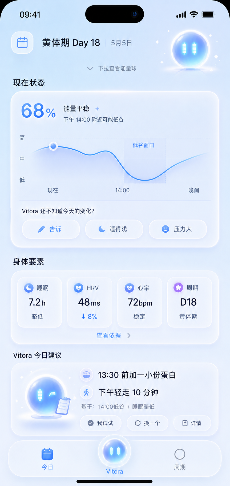
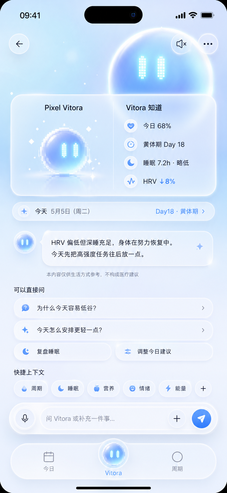
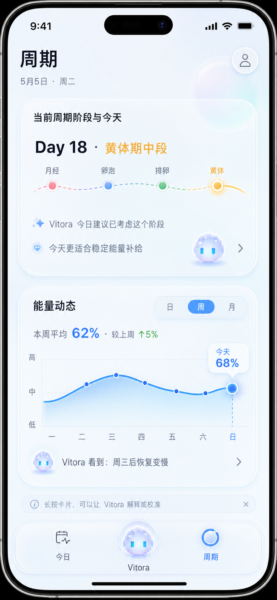

# Vitora Swift Rebuild · Design Language Demo

> 规格集：`004-vitora-swift-rebuild`
> 文档性质：临时视觉系统 Final Truth，用于本轮 IA pivot 后的正式规格适配
> 状态：等待拆回正式 `design-tokens.md`、`components.md`、`wireframes.md`、`ia.md`、`interaction-acceptance.md`、`tasks.md`
> 语言：简体中文
> 日期：2026-05-05

本文档定义 Vitora Swift rebuild 的视觉方向、材质规则、组件气质和纠偏原则。它不替代当前正式规格文件，也不写 Swift 实现任务。后续正式适配批次必须把本文和 `wireframes-walkthrough-demo.md` 一起拆入正式 specs，再继续 SpecKit Pro implementation。

设计北极星：

**弥散渐变背景 + 清透拟态玻璃组件 + Pixel Vitora 陪伴体**

英文工作名：

**Aura Glass Pixel Companion**

中文工作名：

**弥散玻璃像素陪伴体**

---

## 0. 使用规则与权威边界

| ID | 规则 | 说明 |
| --- | --- | --- |
| DLD-RULE-001 | 本文是临时视觉高规则。 | 它记录本轮讨论和 `assets/design_04/` 证据后的设计系统决定。 |
| DLD-RULE-002 | 本文不直接替代正式 specs。 | 后续必须先更新 `facts.md`、`decision-log.md`，再更新派生规格。 |
| DLD-RULE-003 | 实现不能只读本文。 | 代码实现仍需以正式 `spec.md`、`ia.md`、`wireframes.md`、`components.md`、`design-tokens.md`、`tasks.md` 为准。 |
| DLD-RULE-004 | 本文用于记录纠偏目标。 | 适配前 specs 存在 Luna 命名、Apple Health dashboard 倾向、旧 Cycle 日历模型和旧沉浸聊天验收；正式规格必须持续防止这些方向回归。 |
| DLD-RULE-005 | 本文不写数据库、接口、Swift 架构。 | 只定义视觉语言、组件表达、交互材质和视觉验收。 |
| DLD-RULE-006 | 本文遵守产品事实。 | 不做打卡、连续天数、任务压力、诊断治疗、红点焦虑和商业化占位。 |

### 0.1 后续正式适配顺序

| 顺序 | 文件 | 适配目标 |
| --- | --- | --- |
| 1 | `00-product-reset/decision-log.md` | 记录设计语言和 IA pivot 的正式决策。 |
| 2 | `facts.md` | 更新用户面对的 assistant 名称为 Vitora，并锁定 Pixel Vitora 作为品牌 IP。 |
| 3 | `ia.md` / `userflows.md` / `spec.md` | 吸收 Today、Vitora、Cycle 新 IA 与全局 assistant layer。 |
| 4 | `wireframes.md` / `components.md` / `design-tokens.md` | 把本文拆成正式视觉、组件、token 规则。 |
| 5 | `interaction-acceptance.md` | 把本文的视觉和交互验收转成可测试标准。 |
| 6 | `tasks.md` | 增加 IA Pivot Adaptation tasks，再恢复 implementation。 |

---

## 1. Evidence Index

### 1.1 本地设计证据

| Evidence ID | Path | 证明什么 | 不能照搬什么 |
| --- | --- | --- | --- |
| EV-D04-TODAY | `assets/design_04/today_tab.png` | Today 应使用浅蓝弥散背景、清透玻璃卡、Pixel Vitora 右上陪伴、状态曲线、身体要素、建议卡和低凸起 Vitora tab face。 | 不把所有蓝色发光做得过强；不要让玻璃遮挡可读性；不要把 Today 做成纯数字 dashboard。 |
| EV-D04-VITORA | `assets/design_04/vitora_tab.png` | Vitora Tab 是活的 assistant 空间：大 Pixel Vitora 背景、上下文卡、对话气泡、直接问、快捷上下文、输入 dock。 | 不让“可以直接问”和快捷上下文占满屏幕；不把 Vitora 变成普通功能卡片集合。 |
| EV-D04-CHIP | `assets/design_04/vitora_chip_clicked.png` | 快捷上下文应该贴近输入区，像小型 icon chips / tool belt；点击后可展开上下文卡。 | 不把快捷上下文放成大卡片，不和主对话竞争视觉优先级。 |
| EV-D04-CYCLE-A | `assets/design_04/cycle_a.png` | Cycle 可用大玻璃卡和大背景光弧表现长期节律。 | 右上 human avatar 错误；应换成 Pixel Vitora 或 profile/settings。 |
| EV-D04-CYCLE-B | `assets/design_04/cycle_b.png` | Cycle 阶段卡可更强地突出 Day 18 和阶段轴。 | human avatar 错误；阶段卡信息略重，需控制卡片密度。 |
| EV-D04-CYCLE-C | `assets/design_04/cycle_c.png` | Cycle 可把阶段关系卡和能量动态卡作为首页两大组件。 | 需要减少纯 dashboard 感；Pixel Vitora 形象需统一。 |
| EV-D04-CYCLE-D | `assets/design_04/cycle_d.png` | 当前最接近目标 Cycle 方向：Pixel Vitora + 玻璃卡 + 阶段关系 + 能量动态 + TipKit 提示。 | 图表和 IP 仍需统一成 blue/cyan-first；提示不能长期常驻。 |

### 1.2 生成参考图证据

| Evidence ID | Path | 用途 | 注意 |
| --- | --- | --- | --- |
| EV-GEN-DIR | `/Users/bytedance/.codex/generated_images/019deba6-bdfd-75f2-a0fb-83a61fe633d5/` | 存放本轮生成的 Today / Vitora / Cycle 视觉探索图。 | 生成图只作探索证据，正式方向以 `assets/design_04/` 和本文规则为准。 |
| EV-GEN-VITORA | 同目录中 2026-05-05 20:50 附近生成图 | 证明 Pixel Vitora hero + 玻璃对话空间方向成立。 | 需要保证 Pixel Vitora 是像素球，不退化成 smooth orb。 |
| EV-GEN-TODAY | 同目录中 2026-05-05 20:53 附近生成图 | 证明 Today 可以用清透玻璃与弥散背景保持高级感。 | 如果过像 Apple Health dashboard，需要按本文降低临床感。 |
| EV-GEN-CYCLE | 同目录中 2026-05-05 21:00 附近生成图 | 证明 Cycle 两卡首页结构可行。 | 视觉不作为最终完稿，需以 `cycle_d.png` 的 IP 方向修正。 |

### 1.3 证据预览

> 这些图片用于人工比对，不作为代码资源引用。后续正式规格可继续引用路径，但不能把某张图的所有细节当作不可变目标。

### 1.4 设计方法来源

| Source | 本项目采用方式 |
| --- | --- |
| Apple [Materials](https://developer.apple.com/design/Human-Interface-Guidelines/materials) | 玻璃材质用于建立层级、空间和背景连续性；必须保持文字可读。 |
| Apple [Charts](https://developer.apple.com/design/human-interface-guidelines/charts) | 图表只突出少数关键洞察，不堆所有数据；Today 看今日窗口，Cycle 看长期趋势。 |
| Apple [Sheets](https://developer.apple.com/design/human-interface-guidelines/sheets) | 3/4 Vitora 浮层和二层详情保持来源上下文，不强行切 Tab。 |
| Apple [Context Menus](https://developer.apple.com/design/human-interface-guidelines/context-menus) | 对象长按可提供“问 Vitora / 校准 / 查看详情”，减少首页按钮污染。 |
| Apple [TipKit](https://developer.apple.com/documentation/tipkit) | 隐藏手势只用一次性轻提示教学，不能长期打扰。 |
| Apple [Feedback](https://developer.apple.com/design/human-interface-guidelines/feedback) | 用户动作后必须知道状态、结果和下一步，尤其是 AI 理解、保存、复盘。 |
| Material 3 Expressive [design language](https://developer.android.com/design/ui/wear/guides/get-started/design-language) | 用色彩、形状、排版和动效建立品牌情绪，而不是只复刻系统 UI。 |
| NN/g [Usability Heuristics](https://media.nngroup.com/media/articles/attachments/Heuristic_Summary_A4_compressed.pdf) | 遵守状态可见、识别优于记忆、一致性、美学极简和错误恢复。 |

---

## 2. Design North Star

### 2.1 一句话定义

Vitora 的视觉系统是一个 **轻蓝弥散空间里生活着 Pixel Vitora 的清透玻璃 AI wellness app**。

它应该让用户感到：

| 感受 | 设计手段 |
| --- | --- |
| 被陪伴，而不是被监测 | Pixel Vitora 在关键位置出现；文案是“Vitora 看到 / Vitora 知道 / 告诉 Vitora”。 |
| 有智能，但不黑盒 | 状态、身体要素、建议、趋势都给出轻解释和可校准入口。 |
| 有健康数据，但不临床 | 数据放在清透卡片和柔和曲线里，避免 Apple Health 式白底表格和医疗警报感。 |
| 有高级感，但不冷 | 弥散蓝光、玻璃边缘、柔和像素 IP、轻动效共同构成品牌记忆。 |
| 有行动，但不任务化 | 今日建议叫“我试试 / 换一个 / 详情”，不出现完成率、连续天数、失败状态。 |

### 2.2 设计语言关键词

| 关键词 | 含义 | 使用范围 |
| --- | --- | --- |
| Aura | 页面背景的弥散光场，给 Vitora “活在 app 里”的空间感。 | 三个 Tab、Vitora 浮层、Energy Ball。 |
| Glass | 组件半透明、白色边缘、轻阴影、背景穿透。 | 首页卡、sheet、chips、input dock、tab bar。 |
| Pixel | Vitora IP 是像素小球，眼睛和边缘有明确像素颗粒。 | IP、tab face、assistant avatar、thinking/listening states。 |
| Companion | Vitora 不是装饰，而是解释、校准、建议、复盘的入口。 | Today、Vitora、Cycle、二层 IA。 |
| Calm Intelligence | 只展示对用户此刻有价值的判断。 | 文案、图表、信息密度、AI 输出。 |

### 2.3 设计反目标

| 反目标 | 为什么不能做 |
| --- | --- |
| Apple Health dashboard | 太系统、太理性、太临床，用户感到被监测而不是被陪伴。 |
| 普通白卡 SaaS UI | 没有品牌记忆，和 Vitora 作为 AI companion 的定位不匹配。 |
| 纯可爱游戏 UI | 会削弱健康数据和建议的可信度。 |
| 重紫色梦幻 UI | 容易偏冥想/占卜，不适合状态、睡眠、HRV、周期等数据场景。 |
| Smooth orb IP | 容易变成普通光球，缺少“像素小人 / 角色”辨识度。 |
| Human avatar / pet avatar | 与 Pixel Vitora 冲突，也会让 Cycle/Today 的角色体系不统一。 |

---

## 3. Foundation System

### 3.1 Background System

| Token Candidate | 视觉规则 | 用途 |
| --- | --- | --- |
| `vt.bg.aura.base` | `#F7FBFF` 到 `#EEF8FF` 的浅蓝白底。 | 全 app 默认背景。 |
| `vt.bg.aura.cyan` | 柔和 cyan 弥散光，透明度低，位置随页面主题变化。 | Today 状态区、Vitora hero、Cycle 图表背景。 |
| `vt.bg.aura.blue` | 稳定主蓝光晕，不能过饱和。 | 选中、状态曲线、Pixel Vitora glow。 |
| `vt.bg.aura.lavender` | 淡紫只用于边缘和次级氛围。 | Vitora hero 背景、Cycle 角落，不成为主色。 |
| `vt.bg.aura.warm` | 极少量 warm gold。 | 周期黄体期 marker、建议卡轻提示。 |

背景规则：

| Rule ID | Rule |
| --- | --- |
| BG-001 | 背景必须是浅蓝弥散，不使用纯白平底作为主画布。 |
| BG-002 | 弥散光是空间，不是装饰 blob；不能出现离散大圆球、bokeh、营销页式渐变。 |
| BG-003 | 页面内容滚动时背景可以固定或轻微 parallax，但不能影响阅读。 |
| BG-004 | Today 背景最清爽，Vitora 背景最有生命感，Cycle 背景最平静和长周期。 |
| BG-005 | Support / Privacy 页面减少弥散强度，提高实用性和可读性。 |

### 3.2 Color System

| Role | Suggested Range | Usage |
| --- | --- | --- |
| Primary Blue | `#2F80ED` / `#4A90F5` / `#5AC8FA` | 主要行动、曲线、选中态、Vitora 眼睛。 |
| Cyan Glow | `#8EDBFF` / `#BFEFFF` / `#D7F7FF` | Pixel Vitora aura、玻璃边缘高光、图表填充。 |
| Ink Text | `#0B1533` / `#111827` | 标题、关键数值、正文。 |
| Secondary Text | `#667085` / `#7A8599` | 日期、解释、副标题、轴标签。 |
| Soft Line | `rgba(110,150,190,0.18)` | 图表网格、卡片分割、输入分割。 |
| Glass White | `rgba(255,255,255,0.54-0.82)` | 首页卡、chips、tab bar。 |
| Luteal Gold | `#F2B84E` / `#FFD98A` | 黄体期 marker 和少量暖色提示。 |
| Positive Green | `#34C759` / `#54C88B` | 正向趋势、改善提示，少量使用。 |
| Warning Red | `#FF5A5F` | 只用于合规必须注意的状态；主路径避免焦虑红。 |

颜色规则：

| Rule ID | Rule |
| --- | --- |
| COLOR-001 | 蓝 / 青是品牌主色，紫色是氛围，不是主色。 |
| COLOR-002 | 同一页面最多一个强蓝焦点；其他蓝色降级为轻描边或轻底。 |
| COLOR-003 | 周期四阶段可有 pink / blue / green / gold，但必须低饱和，黄体期当前点可以稍暖。 |
| COLOR-004 | 数字和正文必须用 ink text，不用浅蓝承载长文。 |
| COLOR-005 | 玻璃卡上的文本对比优先于透明效果；必要时提高玻璃不透明度。 |

### 3.3 Glass Material Levels

| Level | Name | 视觉 | 用途 |
| --- | --- | --- | --- |
| G0 | Aura Background | 无卡片，只是弥散空间。 | 页面底层、Energy Ball 背景。 |
| G1 | Clear Glass | 透明感强，白色边缘，软蓝阴影，背景可见但不干扰。 | 第一层 IA 主卡、Today/Cycle 大卡、Vitora 问题条。 |
| G2 | Readable Glass | 白度更高，背景穿透更低，边缘仍有玻璃感。 | 二层详情、长文本、AI 理解确认。 |
| G3 | Control Glass | pill / chip / input dock，形状清晰，交互反馈明显。 | chips、segmented control、input dock、buttons。 |
| G4 | Critical Surface | 近白底，玻璃感最低，强调可读和确认。 | 数据导出、账号移除、隐私法律、错误恢复。 |

玻璃规则：

| Rule ID | Rule |
| --- | --- |
| GLASS-001 | 第一层 IA 优先用 G1；二层内容多时用 G2；敏感操作用 G4。 |
| GLASS-002 | 玻璃边缘必须有 1px 左右高光边框；阴影偏蓝，不用黑重阴影。 |
| GLASS-003 | 卡片内部不能再套重卡；如果需要分组，用轻分割线、pill 或局部 tint。 |
| GLASS-004 | Glassmorphism 不能牺牲可读性；正文区域背景必须足够清。 |
| GLASS-005 | 大卡圆角可以 24-32；小控件 16-22；Tab / input 使用 pill。 |

### 3.4 Typography

| Role | 规格方向 | 用途 |
| --- | --- | --- |
| Page Title | 34-40pt, semibold/bold, ink | `今天`、`Vitora`、`周期` 顶级页面。 |
| Section Title | 20-24pt, semibold | 现在状态、身体要素、Vitora 今日建议、能量动态。 |
| Card Title | 17-20pt, semibold | 卡片内部标题。 |
| Numeric Hero | 48-64pt, bold/display | Today 68%、Cycle Day 18、能量动态 62%。 |
| Body | 15-17pt, regular/medium | 解释文案、Vitora 对话。 |
| Caption | 12-14pt, regular | 日期、合规提示、图表轴标签。 |
| Chip Text | 14-16pt, medium | 快捷上下文、校准 chips。 |

排版规则：

| Rule ID | Rule |
| --- | --- |
| TYPE-001 | 数字必须配状态词，例如 `68% 能量平稳`，不能只显示数字。 |
| TYPE-002 | 中文正文行高保持 1.35-1.55，避免玻璃卡内拥挤。 |
| TYPE-003 | 首页每个卡片只允许 1 个视觉主标题；解释文本不抢主标题。 |
| TYPE-004 | 按钮、chips、tab 文案不得溢出；必要时缩短文案而不是压缩字距。 |
| TYPE-005 | 不使用负字距，不用 viewport-based font scaling。 |

### 3.5 Icon And Illustration

| 类型 | 规则 |
| --- | --- |
| System Icon | 可用于日历、睡眠、HRV、心率、设置、发送、语音，但必须放入玻璃或轻蓝 icon 容器。 |
| Pixel Vitora | 只用于 assistant 身份、tab face、陪伴、AI 洞察、状态反馈。 |
| Category Icon | 睡眠、周期、营养、情绪、能量可用圆角小图标，色彩低饱和。 |
| Illustration | P0 不做大插画堆叠；建议卡可有小 Pixel Vitora 场景，但不抢内容。 |

禁用：

| 禁用项 | 原因 |
| --- | --- |
| human avatar 作为 Vitora | 与 Pixel Vitora 品牌 IP 冲突。 |
| pet-like animal IP | 产品不是宠物养成，避免养成压力。 |
| 纯 SF Symbols 裸图标 | 太系统，缺少品牌感。 |
| 过多 emoji | 降低商业级精致度。 |

### 3.6 Chart System

| Chart | 用途 | 视觉规则 |
| --- | --- | --- |
| Today rhythm curve | 显示今日内能量走势和关键低谷窗口。 | 单条蓝色曲线 + 当前点 + 低谷窗口高亮；不堆多线。 |
| Body factor tiles | 解释状态依据。 | 不做图表，使用紧凑数值 tile。 |
| Cycle phase axis | 显示周期阶段和今天位置。 | 阶段点低饱和，当前黄体期用 warm gold。 |
| Cycle energy dynamics | 显示长期能量趋势。 | 日/周/月切换，单曲线或低透明面积，不做医疗指标堆叠。 |
| Callout | 解释局部点。 | 小气泡贴近点位，最多 2 行解释 + `问 Vitora ›`。 |

图表规则：

| Rule ID | Rule |
| --- | --- |
| CHART-001 | 图表必须回答一个问题：今天何时低谷、这个阶段意味着什么、长期趋势如何。 |
| CHART-002 | 不把 HRV、心率、睡眠、周期全部画成同一首页复杂图。 |
| CHART-003 | Today 看“今日内窗口”，Cycle 看“跨天/周/月趋势”。 |
| CHART-004 | 图表点选只出现 callout，不替代二层详情。 |
| CHART-005 | 图表文字使用高/中/低、现在/14:00/晚间等自然语言，不强迫用户理解模型。 |

### 3.7 Motion And Feedback

| Motion | 用途 | 规则 |
| --- | --- | --- |
| Pixel breathe | IP idle 生命感。 | 轻微 scale / glow，循环慢，不影响阅读。 |
| Pixel blink | IP 眨眼。 | 偶发，眼睛像素闪动，不做夸张表情。 |
| Press feedback | 卡片、chips、context menu。 | 卡片微缩、haptic、光晕收紧。 |
| Pull-to-reveal | Energy Ball。 | 弹性头部，两个阈值：半展开、全屏仪式。 |
| Sheet present | Vitora 3/4 浮层、二层详情。 | 自下而上，保留来源上下文。 |
| Input focus | Vitora input dock。 | keyboard 避让，tab CTA 降低存在感。 |
| AI thinking | Vitora 解析输入。 | Pixel particles / small shimmer，不用长 loading。 |

动效规则：

| Rule ID | Rule |
| --- | --- |
| MOTION-001 | 动效服务状态理解，不做纯炫技。 |
| MOTION-002 | 所有动画必须可中断；Energy Ball 仪式可跳过。 |
| MOTION-003 | 隐藏手势必须有一次性 TipKit 教学和 fallback。 |
| MOTION-004 | 不使用长时间 loading 伪装 AI 智能。 |

### 3.8 Accessibility And Legibility

| Rule ID | Rule |
| --- | --- |
| A11Y-001 | 主触控目标不小于 44pt。 |
| A11Y-002 | 玻璃卡文字必须通过人工对比检查；小灰字不能承载关键行动。 |
| A11Y-003 | Pixel Vitora 装饰态不能成为唯一状态表达；状态必须有文本。 |
| A11Y-004 | 长按不是唯一入口；单击进入二层 IA，二层有 `⋯` fallback。 |
| A11Y-005 | 动态字体下按钮和卡片不溢出，必要时卡片增高。 |
| A11Y-006 | 图表不得只靠颜色表达含义；需要标签、状态词或 callout。 |

---

## 4. Pixel Vitora IP System

### 4.1 IP 定义

Pixel Vitora 是一个生活在 app 里的 **像素风格发光小球**。

它不是：

| 不是 | 原因 |
| --- | --- |
| smooth orb | 缺少像素角色辨识度。 |
| human avatar | 与 `assets/design_04/cycle_a/b` 中的 human 头像方向冲突。 |
| pet / animal | 容易滑向养成系统，P0 禁止养成压力。 |
| 纯 icon | Vitora 是 assistant，不是按钮图标。 |
| 吉祥物贴纸 | 它要承载 AI 状态和上下文，不只是装饰。 |

### 4.2 形态规则

| 部位 | 规则 |
| --- | --- |
| Body | 圆形或软圆形小球，但边缘必须有像素阶梯颗粒。 |
| Eyes | 两个竖向 cyan 像素眼，像素格明显，不能是平滑椭圆。 |
| Aura | 外层有蓝青光晕，可有淡紫边缘，但主体保持蓝。 |
| Particles | 少量方形 sparkle / pixel dust，体现生命感。 |
| Shadow | 柔和落地光，避免实体玩具感。 |
| Expression | P0 只需 idle、listening、thinking、saved、low-confidence 五种。 |

### 4.3 状态

| State | 视觉 | 出现场景 |
| --- | --- | --- |
| `idle` | 轻呼吸、偶发眨眼。 | Today 装饰、tab face、Vitora 默认页。 |
| `listening` | 眼睛更亮，周围有小声波或圆环。 | 语音录入、输入聚焦。 |
| `thinking` | 像素颗粒围绕，眼睛轻闪。 | AI 解析、生成理解。 |
| `responding` | 光晕稳定，旁边出现气泡。 | Vitora 回复。 |
| `saved` | 小 gold sparkle，一次性反馈。 | 用户确认保存。 |
| `lowConfidence` | 光晕降低，出现轻问号/提示，不用红色。 | 数据不足、周期估算低置信度。 |

### 4.4 Placement Rules

| 位置 | 大小 | 交互 | 规则 |
| --- | --- | --- | --- |
| Today 右上角 | 小 | P0 装饰，不抢主动作。 | 用来降低 dashboard 感；不替代 `告诉 Vitora`。 |
| Today 建议卡 | 小/中 | 可轻微指向建议来源。 | 只在建议卡需要情绪时出现。 |
| Vitora Tab hero | 大 | 视觉中心，轻动效。 | 是 Vitora 的“居住空间”。 |
| Vitora message avatar | 小 | 与消息绑定。 | 只辅助识别 Vitora 发言。 |
| Cycle card | 小/中 | 作为 Vitora 看到/建议的标识。 | 不使用 human avatar。 |
| Bottom tab CTA | 中 | 点击进入 Vitora Tab。 | 低凸起，不能遮挡 input dock。 |
| 3/4 sheet header | 小 | 标识来源上下文由 Vitora 处理。 | 需显示来源文字。 |

### 4.5 Pixel Vitora Do / Don’t

| Do | Don’t |
| --- | --- |
| 保持像素眼睛和像素边缘。 | 变成完全平滑的蓝紫光球。 |
| 使用 cyan/blue 主体和淡紫边缘。 | 让紫色成为主色。 |
| 在关键 AI 状态给轻动效。 | 到处闪烁，干扰阅读。 |
| 用于陪伴、解释、校准、保存反馈。 | 用作养成等级、连续天数、VIP 入口。 |
| 在 tab face、Today、Vitora、Cycle 保持一致。 | 每个页面换一个 IP 形态。 |

---

## 5. IA-Level Material Rules

### 5.1 第一层 IA

第一层 IA 是用户每天反复打开的主界面，必须高识别、低负担、强品牌感。

| Surface | Material | 密度 | 交互 |
| --- | --- | --- | --- |
| Today main cards | G1 Clear Glass | 中等 | 单击详情，长按问 Vitora。 |
| Vitora default surface | G1 + hero aura | 中低 | 对话、chips、输入。 |
| Cycle cards | G1 Clear Glass | 中等偏低 | 单击二层，长按 context menu。 |
| Bottom tab | G1/G3 pill glass | 低 | 三 Tab + Pixel Vitora face。 |
| TipKit hint | G3 small glass pill | 极低 | 一次性提示，可关闭。 |

第一层规则：

| Rule ID | Rule |
| --- | --- |
| IA1-001 | 每个主卡只解决一个用户问题。 |
| IA1-002 | 首页不能堆显性 `问 Vitora` 按钮；用对象长按和二层 fallback。 |
| IA1-003 | 玻璃透明度较高，但主文字必须使用 ink。 |
| IA1-004 | Pixel Vitora 出现时要服务情绪或来源，不做随机贴纸。 |
| IA1-005 | 第一层不能出现营销、订阅、VIP、主题、帮助墙。 |

### 5.2 第二层 IA

第二层 IA 负责解释、调整、确认和更密信息。它必须更可读、更结构化。

| Surface | Material | 内容规则 |
| --- | --- | --- |
| 今日状态详情 | G2 Readable Glass sheet | 曲线 + 关键窗口 + 解释 + 告诉 Vitora。 |
| 身体要素详情 | G2 / grouped sections | 每项有数值、趋势、对今天意义、可补充入口。 |
| 今日建议详情 | G2 | 建议、原因、替代方案、提醒、我试试。 |
| 周期阶段详情 | G2 | 透明解释：如何判断、置信度、预测窗口、对 Today 意义。 |
| 能量动态详情 | G2 + chart | 趋势探索、图层切换、Vitora 叙事摘要、关键点。 |
| 支撑设置 | G4 | 简洁列表、明确危险动作、少装饰。 |

第二层规则：

| Rule ID | Rule |
| --- | --- |
| IA2-001 | 第二层可以更密，但必须有清晰标题、关闭、来源和返回。 |
| IA2-002 | 可出现显性 `告诉 Vitora` 或 `⋯`，因为不污染首页。 |
| IA2-003 | 如果有图表，图表下必须有自然语言解释。 |
| IA2-004 | 用户修改或补充事实后，Vitora 必须进入理解确认，不直接保存。 |

### 5.3 Vitora 3/4 Contextual Sheet

从 Today / Cycle 唤醒 Vitora 时，不切 Tab，打开 3/4 浮层。

| 区域 | 视觉 | 规则 |
| --- | --- | --- |
| Backdrop | 原页面轻暗/轻 blur。 | 保留来源页面可识别。 |
| Sheet body | G2 glass with stronger readability。 | 高度约 70-78%，圆角 28-32。 |
| Header | Pixel Vitora + 来源，例如 `来源：今日状态`。 | 来源必须明确。 |
| Context summary | 小卡或 pill。 | 展示当前能量、周期、建议或图表点。 |
| Prompt chips | G3 chips。 | 只显示 2-5 个强相关选项。 |
| Input dock | G3。 | 支持文字、语音、发送、加号。 |

规则：

| Rule ID | Rule |
| --- | --- |
| SHEET-001 | 非 CTA 唤醒永远先打开 3/4 sheet。 |
| SHEET-002 | 上滑才升级完整 Vitora；关闭后回到来源组件。 |
| SHEET-003 | Sheet 内输入不被 bottom tab 或 home indicator 遮挡。 |
| SHEET-004 | AI 理解结果必须可确认、修改、不更新。 |

### 5.4 Context Menu And Callout

| Pattern | Material | 用途 |
| --- | --- | --- |
| Context menu | iOS native context menu | 长按对象，显示问 Vitora / 告诉不准 / 查看详情。 |
| Callout | Small glass bubble | 点图表数据点后解释局部点位。 |
| TipKit hint | Small glass pill | 教用户长按一次，不常驻。 |

规则：

| Rule ID | Rule |
| --- | --- |
| ASK-001 | 单击是主路径，长按是快捷路径。 |
| ASK-002 | 首页不常驻大量“问 Vitora”按钮。 |
| ASK-003 | Callout 只解释局部点，不替代二层 IA。 |
| ASK-004 | Context menu 只放 2-3 个对象相关动作。 |

### 5.5 Input Dock

| Element | 视觉 | 规则 |
| --- | --- | --- |
| Mic | 左侧圆形玻璃按钮。 | 语音记录入口；P0 可只做录音/转写占位或后续能力提示。 |
| Text field | 长 pill glass。 | Placeholder 随上下文变化。 |
| Plus | 小圆按钮。 | 打开快捷记录类型。 |
| Send | 蓝色圆按钮。 | 有文本或录音后启用。 |
| Quick context chips | 输入上方小 icon chips。 | 周期、睡眠、营养等上下文；记录 `+` 不在输入区内。 |

规则：

| Rule ID | Rule |
| --- | --- |
| INPUT-001 | Vitora Tab 中 input dock 优先级高于底部 CTA。 |
| INPUT-002 | Bottom Vitora face 只低凸起，不遮挡 input dock。 |
| INPUT-003 | 输入后 Vitora 先理解确认，不直接记录。 |
| INPUT-004 | Quick context chips 是工具带，不是主内容。 |

---

## 6. Component Visual Specs

### 6.1 App Shell Components

| Component | Visual Role | Material | Color / Motion | Interaction | Failure Case |
| --- | --- | --- | --- | --- | --- |
| PrimaryTabBar | 稳定三主区导航。 | G1 pill glass。 | 未选灰蓝，选中蓝；背景透明。 | 点击切换；保留 scroll 状态。 | 变成硬白 tab、黑色中心按钮、第四 Tab。 |
| VitoraFaceTabButton | 全局 assistant CTA。 | Pixel Vitora face inside low-lift glass halo。 | cyan eyes、soft glow、selected 时轻呼吸。 | 点击进入 Vitora Tab。 | 心形 icon、smooth orb、过高悬浮遮挡输入。 |
| ScreenScaffold | 每页空间结构。 | Aura background + safe area。 | Today 清爽、Vitora 更强光、Cycle 更平静。 | 支持滚动、sheet、键盘。 | 纯白 canvas、页面 section 全部做实体卡。 |
| NativeSheetSurface | 二层和上下文任务。 | G2 / G4。 | 标题 ink，关闭清晰。 | drag / close / confirm。 | 无关闭、卡片套卡片、背景不可辨。 |
| TipKitHint | 一次性教学。 | Small G3 pill。 | 轻蓝 sparkle，可关闭。 | 停留 2-3 秒后出现一次。 | 长期常驻、像广告条。 |

### 6.2 Today Components

| Component | Visual Role | Material | Color / Data | Interaction | Failure Case |
| --- | --- | --- | --- | --- | --- |
| DateCycleContextStrip | 顶部上下文。 | Icon glass + text。 | 蓝色日历 icon，周期文字 ink/blue。 | 点击进周期日历。 | 日历放到 Cycle 首页、顶部太拥挤。 |
| VitoraIPDecoration | 陪伴感装饰。 | Pixel Vitora small aura。 | 右上蓝青像素小球。 | P0 idle/blink，非主动作。 | 变成人像、动物、可爱贴纸、抢主 CTA。 |
| PullEnergyBallHeader | 隐藏仪式层。 | Aura + Pixel/energy orb。 | 蓝青主光，半展开显示 68%。 | 下拉揭示、上滑收起。 | 常驻首页压住状态卡，像刷新控件。 |
| TodayStatusCard | Today 主结论。 | G1 large glass。 | 68% + 状态词 + rhythm curve。 | 点击状态详情；长按 context menu。 | 只有数字没有状态词；图表太复杂。 |
| RhythmCurve | 今日内节律。 | Chart on clear glass。 | 单蓝曲线，低谷窗口轻蓝阴影。 | 二层可点点位 callout。 | 多线 dashboard，用户看不懂。 |
| CalibrationChips | 轻校准。 | G3 chips。 | `[告诉] [睡得浅] [压力大]` 动态。 | 打开 Vitora 3/4 sheet。 | 独立打卡区、每天任务感。 |
| BodyFactorTiles | 状态依据。 | 四个 G1 mini tiles。 | 睡眠、HRV、心率、周期图标。 | 点击详情；长按单项问 Vitora。 | 堆指标无解释、红色焦虑。 |
| VitoraSuggestionCard | 个性化下一步。 | G1 glass + optional IP scene。 | 行动突出，原因次级。 | 我试试、换一个、详情。 | 像任务卡、完成率、待办压力。 |

### 6.3 Vitora Tab Components

| Component | Visual Role | Material | Color / Data | Interaction | Failure Case |
| --- | --- | --- | --- | --- | --- |
| PixelVitoraHero | 活的 assistant 主视觉。 | Aura + Pixel body。 | 大蓝青像素球，淡紫边缘。 | idle/listening/thinking。 | smooth orb、人像、普通 logo。 |
| VitoraKnowsPanel | 当前上下文。 | G1 split glass。 | 今日 68%、黄体期、睡眠、HRV。 | 点击可展开 context card。 | 做成静态 dashboard；内容过多。 |
| DateContextStrip | 时间和周期入口。 | Slim glass pill。 | `今天 5月5日` + `Day18 · 黄体期`。 | 点击周期日历或详情。 | 变成主日历模块。 |
| AssistantMessageBubble | 对话主内容。 | G2 readable bubble。 | Vitora 文案 + 合规短句。 | 可长按复制/问来源。 | 过度解释、医疗语气。 |
| DirectQuestionStrips | 冷启动建议。 | Thin horizontal G1/G3 glass strips。 | 一行一个问题，轻 chevron。 | 点击发起对话。 | 大卡片铺满屏幕。 |
| QuickContextChips | 输入工具带。 | Small icon glass chips。 | 周期、睡眠、营养等上下文；不放记录 `+`。 | 点击部署上下文。 | 变成页面主导航。 |
| VitoraInputDock | 文字/语音入口。 | G3 large pill。 | Mic、placeholder、send；无内部 plus。 | 输入、语音、发送。 | 被中心 Tab 遮挡、无发送按钮、无语音入口。 |
| RichResponseCard | AI 结构化回复。 | G2 card inside conversation。 | 图表、确认、保存、修改。 | 确认保存 / 修改 / 不更新。 | AI 直接写入数据，无确认。 |
| VoiceStatePanel | 录音状态。 | G2 compact panel。 | 波形、时长、重录、转写。 | 录音、重录、转写理解。 | 语音结果直接保存。 |

### 6.4 Cycle Components

| Component | Visual Role | Material | Color / Data | Interaction | Failure Case |
| --- | --- | --- | --- | --- | --- |
| CycleHeader | 周期主入口。 | Aura background。 | 标题 `周期`，右上 profile/settings。 | 点击头像进设置。 | 右上 human avatar 当作 Vitora。 |
| CurrentPhaseRelationCard | 周期阶段与今天。 | G1 large glass。 | Day 18，黄体期 marker，Vitora 今日关系。 | 点击阶段详情；长按 context menu。 | 变成纯科普或纯日历。 |
| PhaseAxis | 周期阶段轴。 | Chart on glass。 | Pink/blue/green/gold 低饱和；当前点暖金。 | 二层可点阶段 callout。 | 色彩过艳，像医疗周期图。 |
| EnergyDynamicsCard | 长期能量动态。 | G1 large glass。 | 日/周/月、62%、趋势曲线、Vitora 叙事。 | 点击详情；长按问 Vitora。 | 复制 Today 今日状态，缺少长期价值。 |
| GranularitySegment | 日/周/月切换。 | G3 segmented control。 | 周 selected 使用 blue glass。 | 点击切换。 | 像主 Tab 或过重按钮。 |
| VitoraNarrativeRow | AI 洞察摘要。 | Small G1 row with Pixel Vitora。 | “Vitora 看到：周三后恢复变慢”。 | 点击或长按问原因。 | 只显示数据不解释。 |
| CycleProfileButton | 设置入口。 | Small glass circular button。 | user/profile icon，不是 Vitora。 | 打开设置 / 我的。 | 进入宽抽屉、VIP、主题商城。 |

### 6.5 Onboarding And Support Components

| Component | Visual Role | Material | Rule |
| --- | --- | --- | --- |
| OnboardingStep | 建立 Vitora 初始上下文。 | G2 readable glass。 | 语气轻，不要求登录，不承诺每日打卡。 |
| HealthKitChoice | 数据增强说明。 | G2/G4。 | 授权和跳过同等清晰；跳过不羞辱。 |
| DataSourcePanel | 管理数据来源。 | G4 practical surface。 | 清楚说明本地、HealthKit、手动输入状态。 |
| NutritionManager | 管理营养补给。 | G2/G4。 | 不销售化，不医学化，只作为 Vitora 上下文。 |
| ReminderPreference | A/B 和复盘提醒。 | G2 practical controls。 | 不出现红点和未完成压力。 |
| DataExportPanel | 数据导出。 | G4。 | 状态、范围、确认、完成反馈明确。 |
| LegalAccountPanel | 隐私法律与账号移除。 | G4。 | 强可读、少装饰、危险动作二次确认。 |

---

## 7. Tab-Specific Rules

### 7.1 Today Tab

视觉目标：

**3 秒内知道：我现在是什么状态、为什么、Vitora 建议我轻轻试什么。**

第一层结构：

| 顺序 | Component | 设计规则 |
| --- | --- | --- |
| 1 | Top cycle/date strip + IP | 左侧日历进入周期日历；右上 Pixel Vitora 是陪伴装饰。 |
| 2 | Pull-to-reveal Energy Ball | 默认隐藏；首次打开和下拉出现；不常驻压住首页。 |
| 3 | Current Status Card | 页面主视觉；曲线表达今日内节律和低谷窗口。 |
| 4 | Body Factors | 解释状态依据；四 tile 简洁，不做复杂图。 |
| 5 | Vitora Daily Suggestion | 个性化建议和行动；文案柔和，不像任务。 |
| 6 | Bottom Tab | Today selected；Vitora face 低凸起。 |

Today 禁用：

| 禁用 | 原因 |
| --- | --- |
| 独立“今日记录” section | 与 light-record 心智冲突，记录应是校准 Vitora。 |
| 大能量球常驻首页 | 会压住状态曲线和身体要素。 |
| AI 监测今日 + 能量球 + 建议卡三重重复 | 会造成 dashboard 重复和主线不清。 |
| 红色低谷警报 | 产品不是医疗预警，也不能制造焦虑。 |

### 7.2 Vitora Tab

视觉目标：

**让用户感觉 Vitora 是一个活的、知道上下文的 AI assistant，而不是空聊天页。**

第一层结构：

| 顺序 | Component | 设计规则 |
| --- | --- | --- |
| 1 | Pixel Vitora hero / context block | IP 与上下文共同出现，建立“Vitora 知道什么”。 |
| 2 | Date/context strip | 今日日期和周期上下文是可进入的信息，不是主卡。 |
| 3 | Assistant message | Conversation 是主线，Vitora 主动给出当前观察。 |
| 4 | Direct question strips | 细长玻璃条，帮助冷启动；不铺满页面。 |
| 5 | Quick context chips | 输入区上方小 icon chips，支持快速部署上下文，不包含记录 `+`。 |
| 6 | Input dock | 文字、语音、发送齐全；记录 `+` 独立在全局 Dock 右侧。 |
| 7 | Bottom tab | 中央 Pixel Vitora face 低凸起，不遮挡 input。 |

Vitora 禁用：

| 禁用 | 原因 |
| --- | --- |
| 空白聊天页 | 用户不知道说什么，AI-native 价值不显性。 |
| 普通 dashboard 卡片堆叠 | Vitora 不是第四个 Today。 |
| 大量功能入口宫格 | 会削弱对话和 assistant 心智。 |
| 输入栏被中心 CTA 遮挡 | 破坏核心交互。 |
| 回复直接写入记录 | AI 必须先理解确认。 |

### 7.3 Cycle Tab

视觉目标：

**长期节律背景 + 长周期能量动态。**

第一层结构：

| 顺序 | Component | 设计规则 |
| --- | --- | --- |
| 1 | Header + profile/settings | 右上是设置入口，不是 Vitora human avatar。 |
| 2 | Current phase relation card | 当前周期阶段与今天的关系，一卡讲清。 |
| 3 | Energy dynamics card | 日/周/月趋势，体现长期价值。 |
| 4 | TipKit hint | 一次性教长按问 Vitora。 |
| 5 | Bottom tab | Cycle selected；Vitora face 仍保持低凸起。 |

Cycle 禁用：

| 禁用 | 原因 |
| --- | --- |
| Cycle 首页放日历预览 | 日历已归 Today 顶部入口；Cycle 首页关注长期背景。 |
| 高级商业化/订阅卡 | P0 不做，且破坏 calm。 |
| 复杂多指标趋势图 | P0 只需要能量动态 + Vitora 叙事。 |
| human avatar | 与 Pixel Vitora IP 冲突。 |

### 7.4 Onboarding

视觉目标：

**让 Vitora 获得最小上下文，不制造账号和打卡压力。**

规则：

| Rule | Spec |
| --- | --- |
| ONB-001 | 使用 G2 readable glass，背景弥散弱一些。 |
| ONB-002 | Pixel Vitora 可以出现，但只作为引导，不做夸张动画。 |
| ONB-003 | HealthKit 授权与跳过同等清楚。 |
| ONB-004 | 周期不确定、数据少时也能继续。 |
| ONB-005 | 不出现 WeChat gate、连续天数、每日目标。 |

### 7.5 Support / Settings

视觉目标：

**实用、可信、清晰，不营销。**

规则：

| Rule | Spec |
| --- | --- |
| SUP-001 | 使用 G4 practical surface，减少弥散和 glow。 |
| SUP-002 | 页面分组清楚，操作路径短。 |
| SUP-003 | 隐私、导出、账号移除优先可读性和确认反馈。 |
| SUP-004 | 不出现 VIP、主题商城、小组件、多设备深度、高级图表。 |
| SUP-005 | 可保留少量 Pixel Vitora 空状态，但不能削弱严肃操作。 |

---

## 8. Current Spec Corrections

以下是本轮 IA / Design Pivot 适配前的问题清单。正式规格已经按这些方向修正；后续若出现回归，应重新按本节纠偏。

### 8.1 `facts.md`

| Current Weakness | Required Correction |
| --- | --- |
| `F-PRODUCT-002`、`F-P0-LUNA-*` 仍把用户面对的 AI 角色称为 Luna。 | 用户面对的 assistant 名称改为 Vitora；如果代码内部暂留 Luna，必须写成 migration debt，不进入用户文案。 |
| Pixel homepage 仍被描述成旧 Luna 像素首页。 | 改成 Pixel Vitora，是 app 内生活的全局 assistant IP。 |
| Cycle 事实仍偏基础概览和日历入口。 | 更新为 Cycle 首页承载长期节律背景和能量动态；周期日历从 Today 顶部进入。 |

### 8.2 `design-tokens.md`

| Current Weakness | Required Correction |
| --- | --- |
| Token 仍偏 `#FAFAFA` / Apple Health / 旧 Figma 实测。 | 增加 aura background、clear glass levels、blue/cyan-first palette。 |
| 缺少 Pixel Vitora 形态、状态和 glow tokens。 | 增加 IP body、eyes、aura、pixel edge、states、particles。 |
| 中央 Tab 仍有旧 Luna / heart / black circle 候选风险。 | 增加 `VitoraFaceTabButton` 和 low-lift CTA 约束。 |
| 玻璃只有 `cardGlass`，缺少按 IA 层级的材质等级。 | 增加 G0-G4 material scale。 |
| 没有明确排除 human avatar / smooth orb。 | 在 token usage rules 中加入反目标。 |

### 8.3 `components.md`

| Current Weakness | Required Correction |
| --- | --- |
| 仍包含 `C-LUNA-*` 命名和旧 Luna 首页。 | 重命名或映射为 Vitora assistant components。 |
| `TodayStateOrb` 容易误导为首页常驻大能量球。 | 改为 Pull-to-reveal Energy Ball，首页主状态是曲线卡。 |
| `TodayQuickRecordCarousel` 仍像独立记录区。 | 删除或改成 CalibrationChips / TellVitoraAction。 |
| `CycleOverviewCard` / `CycleCalendarGrid` 仍按旧 Cycle 日历模型。 | Cycle 首页改为 CurrentPhaseRelationCard + EnergyDynamicsCard；日历归 Today。 |
| `LunaImmersiveChatSurface` 验收旧上滑沉浸态。 | 改为 Vitora full assistant surface + contextual sheet upgrade。 |

### 8.4 `interaction-acceptance.md`

| Current Weakness | Required Correction |
| --- | --- |
| 旧全局导航验收曾使用旧三主区命名。 | 改为 Today / Vitora / Cycle。 |
| 旧 Vitora/Luna 验收曾只验收 immersive chat。 | 改为 Vitora assistant surface：默认态、滚动压缩态、输入态、语音态、context card、rich response、3/4 sheet upgrade。 |
| 旧 Cycle 验收曾是 Cycle Basic + calendar。 | 改为 Cycle long-horizon phase relation + energy dynamics；calendar 从 Today 顶部验收。 |
| 缺少 long-press / context menu / callout / TipKit 验收。 | 增加 askable surfaces 验收。 |
| 缺少 Energy Ball pull-to-reveal 验收。 | 增加隐藏式仪式层验收。 |

### 8.5 `wireframes.md` / `ia.md` / `tasks.md`

| File | Required Correction |
| --- | --- |
| `wireframes.md` | 用 `wireframes-walkthrough-demo.md` 和本文重写 Today / Vitora / Cycle 第一层与二层。 |
| `ia.md` | 收口主结构为 Today 状态、Vitora assistant layer、Cycle 长期背景；设置从 Cycle 右上进入。 |
| `tasks.md` | 停止旧 US6 之后继续实现；插入 IA Pivot Adaptation Phase，先重构已完成 US 里受影响的 UI。 |

---

## 9. QA Checklist

### 9.1 Evidence Coverage

| Check | Pass Criteria |
| --- | --- |
| Q-EV-001 | 文档引用全部 `assets/design_04` 参考图。 |
| Q-EV-002 | 明确标记 `cycle_a/b` 中 human avatar 是 anti-evidence。 |
| Q-EV-003 | 明确标记 generated images 只是探索证据，不是最终像素级目标。 |
| Q-EV-004 | 明确使用 `cycle_d.png` 作为 Cycle 最接近方向。 |

### 9.2 Visual Consistency

| Check | Pass Criteria |
| --- | --- |
| Q-VIS-001 | 背景始终是 blue/cyan-first 弥散渐变。 |
| Q-VIS-002 | 第一层 IA 主卡使用 G1 clear glass。 |
| Q-VIS-003 | 第二层和支撑页按可读性提高到 G2/G4。 |
| Q-VIS-004 | Pixel Vitora 在 Today、Vitora、Cycle、Tab CTA 中形态一致。 |
| Q-VIS-005 | 不出现 Apple Health dashboard、smooth orb、人像 Vitora、pet IP、VIP 占位。 |

### 9.3 Component Completeness

| Check | Pass Criteria |
| --- | --- |
| Q-COMP-001 | Today 覆盖 top strip、IP decoration、Energy Ball、status card、curve、chips、body factors、suggestion、bottom tab。 |
| Q-COMP-002 | Vitora Tab 覆盖 hero/context、message、direct questions、quick context chips、input dock、voice、rich response、tab CTA。 |
| Q-COMP-003 | Cycle 覆盖 header/settings、phase relation、phase axis、energy dynamics、segmented control、narrative row、TipKit、二层详情。 |
| Q-COMP-004 | Onboarding / Support 有单独视觉规则，不套用过强 IP 和 glow。 |

### 9.4 Interaction And Accessibility

| Check | Pass Criteria |
| --- | --- |
| Q-INT-001 | 单击进入二层 IA，长按打开 context menu，点图表点出现 callout。 |
| Q-INT-002 | 隐藏手势有 TipKit 一次性提示和二层 `⋯` fallback。 |
| Q-INT-003 | Vitora 3/4 sheet 保留来源上下文，上滑升级完整 Vitora。 |
| Q-INT-004 | Input dock 不被 bottom CTA 遮挡。 |
| Q-A11Y-001 | 玻璃卡文字对比可读，触控目标不小于 44pt。 |
| Q-A11Y-002 | 颜色不是唯一状态表达，图表有文字标签或 callout。 |

### 9.5 Future Pivot Readiness

| Check | Pass Criteria |
| --- | --- |
| Q-PIVOT-001 | 本文明确列出哪些正式 specs 需要修正。 |
| Q-PIVOT-002 | 本文不写实现任务，但足够指导 `design-tokens.md` 和 `components.md` 重写。 |
| Q-PIVOT-003 | 本文与 `wireframes-walkthrough-demo.md` 互补：一个管视觉系统，一个管 IA walkthrough。 |
| Q-PIVOT-004 | 后续 `/speckit.analyze` 前必须先完成正式适配，不直接继续旧 `/speckit.implement`。 |

---

## 10. Usage Rule

后续正式实现前必须满足：

1. 本文的视觉系统进入正式 `design-tokens.md` 和 `components.md`。
2. `wireframes-walkthrough-demo.md` 的 IA 进入正式 `wireframes.md` 和 `ia.md`。
3. `facts.md` 和 `decision-log.md` 先记录 Vitora assistant / Pixel Vitora / Cycle 变更。
4. `tasks.md` 插入 IA Pivot Adaptation Phase。
5. 只有正式 specs 更新并通过 `/speckit.analyze` 后，才继续 `/speckit.implement`。

本文本身不是 implementation source of truth；它是本轮设计系统 pivot 的临时证据和高规则。
