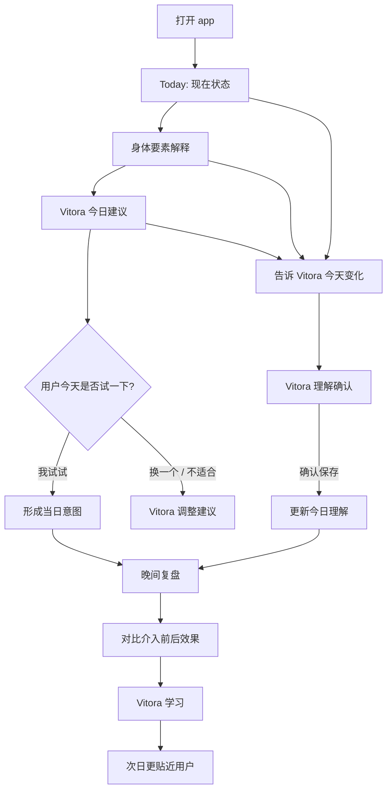
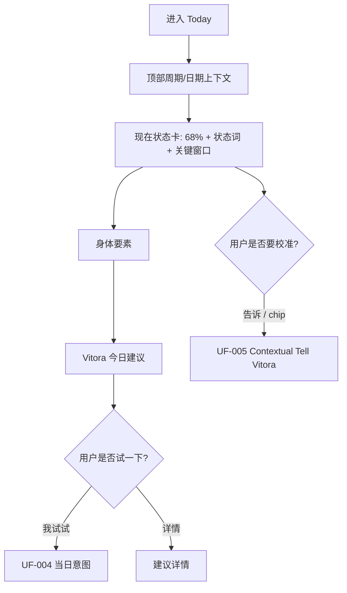
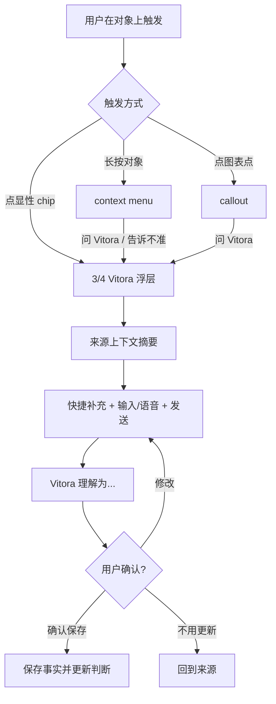

# Vitora Swift Rebuild · 用户流程

> 规格集： `004-vitora-swift-rebuild`
> 批次： Userflows · IA / Design Pivot Adapted
> 日期：2026-05-05
> 状态：当前生效

本文档是 Swift rebuild 的用户流程权威。它把 `facts.md` 锁定的 P0 事实转成用户路径，不写 Swift 架构、数据库、API 或视觉尺寸。

## 0. 权威规则

| 规则 ID | 规则 | 约束 | 来源 |
| --- | --- | --- | --- |
| UFA-001 | `facts.md` 是最高事实来源。 | 本文冲突时先更新 facts。 | F-SOURCE-001 |
| UFA-002 | `wireframes-walkthrough-demo.md` 是本轮 IA pivot evidence。 | 正式流程必须吸收其决定。 | F-SOURCE-005 |
| UFA-003 | `design-language-demo.md` 是本轮视觉交互 evidence。 | 涉及材质、IP、输入和浮层的流程必须服从。 | F-SOURCE-006 |
| UFA-004 | 当前 app 只作 evidence / anti-evidence。 | 不复刻旧跳转、旧记录区、旧沉浸态。 | F-SOURCE-003 |
| UFA-005 | 用户面对 assistant 名称是 Vitora。 | 旧 Luna 仅是历史证据或代码迁移债务。 | F-PRODUCT-002 |

## 1. 流程索引

| 流程 ID | 区域 | 流程 | 优先级 | 决策 | 关联事实 |
| --- | --- | --- | --- | --- | --- |
| UF-000 | App | P0 学习闭环 | P0 Swift MVP | redesign | F-P0-001, F-PRODUCT-004 |
| UF-001 | Onboarding | 最小 Onboarding | P0 Swift MVP | keep | F-P0-ONBOARDING-001 |
| UF-002 | Today | Today 首次打开 | P0 Swift MVP | redesign | F-P0-TODAY-001 |
| UF-003 | Today | Energy Bowl 实时预测与查看数据 | P0 Swift MVP | redesign | F-P0-ORB-001 |
| UF-004 | Today | Vitora 今日建议 / 当日意图 | P0 Swift MVP | redesign | F-P0-AB-001 |
| UF-005 | Vitora | 上下文告诉 Vitora | P0 Swift MVP | redesign | F-P0-VITORA-002, F-P0-RECORD-001 |
| UF-006 | Vitora | 完整 Vitora Assistant Surface | P0 Swift MVP | redesign | F-P0-VITORA-001, F-P0-VITORA-003 |
| UF-007 | Review | 晚间复盘 | P0 Swift MVP | redesign | F-P0-REVIEW-001 |
| UF-008 | Cycle | Cycle 长期概览 | P0 Swift MVP | redesign | F-P0-CYCLE-001 |
| UF-009 | Cycle | Cycle 详情 / 能量趋势探索 | P0 Swift MVP | redesign | F-P0-CYCLE-002 |
| UF-010 | Support | 隐私 / 数据 / 营养支撑 | P0 Swift MVP | redesign | F-P0-SUPPORT-001 |
| UF-101 | Notifications | Morning proactive notification | P1 After MVP | defer | F-OUT-002 |
| UF-102 | AI | Local Gemma / agentic usage | P2 Backlog | defer | F-P0-AI-002 |

## 2. P0 学习闭环

**目标**：用户不需要每天填表，也能看到 Vitora 如何理解今天，并在关键变化时轻轻校准。

**入口**：Onboarding 后进入 Today；每日打开 app；从通知、Vitora Tab 或 Cycle 回到 Today。

**主路径**：

1. Today 显示现在状态、身体要素、Vitora 今日建议。
2. 用户可接受/调整今日建议，形成当日意图。
3. 用户在状态、要素、建议、Cycle 或 Vitora Tab 中告诉 Vitora 一件重要变化。
4. Vitora 先给出理解确认，用户确认后保存。
5. 晚间复盘比较 app 当天介入前后的感受。
6. Vitora 用反馈改进后续建议。

**决策点**：是否授权 HealthKit；是否接受建议；是否校准 Vitora；是否完成晚间复盘。

**空状态 / 低数据路径**：没有 HealthKit 或历史不足时，Today 显示低数据状态和可补充入口，Vitora 仍可通过文字/快捷上下文保存用户确认事实。

**退出状态**：当天至少形成一次状态理解、建议意图、校准记录或复盘反馈；没有未完成压力。

**关联事实**：F-PRODUCT-003, F-P0-TODAY-001, F-P0-VITORA-002, F-P0-RECORD-001, F-P0-REVIEW-001。

## 3. P0 核心流程

### UF-001 · 最小 Onboarding

**目标**：以最少步骤让 Vitora 获得初始上下文，同时不设置 WeChat 或 HealthKit gate。

**入口**：首次安装；账号移除后重新进入；本地状态缺失。

**主路径**：

1. 用户输入偏好称呼。
2. 用户选择或跳过周期基础信息。
3. 用户选择关注方向，例如下午低谷、睡眠恢复、周期变化。
4. 用户选择连接 HealthKit 或先跳过。
5. Vitora 用一句话说明它会先给低负担今日理解。
6. 用户进入 Today。

**决策点**：周期是否确定；HealthKit 是否授权；是否跳过可选项。

**空状态 / 低数据路径**：用户可全部低数据进入；Today 和 Vitora 会说明目前只基于已知信息。

**退出状态**：AppGate 完成；用户进入 Today；Vitora 获得最小初始上下文。

**关联事实**：F-P0-ONBOARDING-001, F-P0-DATA-001, F-P0-DATA-002。

### UF-002 · Today 首次打开

**目标**：3 秒内回答“我今天怎么样、为什么、下一步是什么”。

**入口**：每日默认启动；从 onboarding 完成进入；从 Vitora/Cycle 返回。

**主路径**：

1. 顶部显示日历入口、周期阶段、日期和 Pixel Vitora 陪伴装饰。
2. 现在状态卡显示状态百分比、状态词、关键低谷窗口和今日节律曲线。
3. 状态卡内提供轻校准入口：`告诉`、`睡得浅`、`压力大` 等动态 chips。
4. 身体要素展示睡眠、HRV、心率、周期四个主要依据。
5. Vitora 今日建议给出一个低负担行动、原因和详情入口。

**决策点**：是否打开周期日历；是否进入状态详情；是否校准 Vitora；是否接受建议。

**空状态 / 低数据路径**：低数据时仍显示已知周期/手动信息、置信度和“告诉 Vitora 一件事”入口。

**退出状态**：用户停留 Today、进入二层详情、打开 Vitora contextual sheet 或形成当日意图。

**关联事实**：F-P0-TODAY-001, F-P0-TODAY-002, F-P0-RECORD-001。

### UF-003 · Energy Bowl、周期线轴与查看数据

**目标**：让用户在 Today 首屏直接理解当前综合状态和周期背景；完整预测与判断依据进入今日分析，不依赖顶部下拉手势。

**入口**：Today 首页能量碗内的 `查看数据` 小入口；晚间复盘仍可使用能量对比表达。

**主路径**：

1. 用户进入 Today，首屏看到分层综合能量碗、单层高对比数字、状态词、`查看数据` 和无背景周期线轴，数据小标签不在首页出现，文字不压在碗体上。
2. 用户点击能量碗，进入今日状态详情。
3. 用户点击 `查看数据`，进入今日分析，先查看数据小标签和综合实时预测，再横向查看睡眠、HRV、心率、周期，并看到综合判断解释。
4. 用户在今日分析的实时预测上看到高/中/低纵轴、小时点位和当前时间气泡。
5. 睡眠、周期、HRV、心率只作为今日分析依据保留，不在 Today 首页作为预测切换入口。

**决策点**：是否查看状态详情；是否查看数据/分析；是否让 Vitora 校准。

**空状态 / 低数据路径**：低数据时显示“基于目前信息”的能量理解和可补充入口，不夸大确定性。

**退出状态**：用户停留 Today、进入今日状态详情、进入今日分析/身体要素或打开 Vitora contextual sheet。

**关联事实**：F-P0-ORB-001, F-VISUAL-004。

### UF-004 · Vitora 今日建议 / 当日意图

**目标**：让建议成为轻量当日意图，并在晚间复盘回收效果。

**入口**：Today 建议卡；状态详情；Vitora Tab；晚间复盘后的次日建议。

**主路径**：

1. Vitora 今日建议展示一个具体、低负担行动。
2. 用户点 `详情` 看为什么、替代方案和提醒偏好。
3. 用户点 `我试试`，系统保存为当日意图。
4. 用户可 `换一个` 或标记 `不适合`，Vitora 重新生成或记录不适配反馈。
5. 晚间复盘引用当日意图并询问是否有帮助。

**决策点**：我试试、换一个、不适合、提醒与否、自定义提醒时间。

**空状态 / 低数据路径**：上下文不足时只给更泛但低风险的建议，或保持安静并邀请用户补充事实。

**退出状态**：当日意图保存、建议被替换、或不适合反馈被记录；不产生任务债务。

**关联事实**：F-P0-AB-001, F-P0-REVIEW-001。

### UF-005 · 上下文告诉 Vitora

**目标**：让记录和校准自然发生在真实对象中，而不是让用户每天打开记录表。

**入口**：Today 状态卡、身体要素、今日建议、周期阶段、能量动态、周期日历、晚间复盘、Vitora Tab 输入。

**主路径**：

1. 用户点 `告诉` chip、长按 askable surface，或在 callout 里选择 `问 Vitora`。
2. 系统打开 3/4 Vitora sheet，显示来源：今日状态、身体要素、今日建议、周期阶段或能量动态。
3. Sheet 显示当前上下文摘要、快捷补充、输入框、语音入口和发送。
4. 用户输入后，Vitora 生成理解确认。
5. 用户确认保存、修改或不用更新。
6. 保存后回到来源组件，并更新状态/建议/趋势。

**决策点**：是否问原因；是否告诉不准；是否确认保存；是否升级完整 Vitora。

**空状态 / 低数据路径**：低数据时该流程是核心输入路径；Vitora 说明会用补充提高理解。

**退出状态**：一条被确认的上下文事实，或一次明确取消；用户回到来源页面。

**关联事实**：F-P0-VITORA-002, F-P0-RECORD-001。

### UF-006 · 完整 Vitora Assistant Surface

**目标**：让 Vitora Tab 成为活的 assistant 空间，而不是空聊天页或功能 dashboard。

**入口**：底部中心 Vitora face CTA；3/4 contextual sheet 上滑升级；晚间复盘入口；用户主动打开 Vitora。

**主路径**：

1. 用户点击底部 Vitora face。
2. 默认打开完整 Vitora assistant surface。
3. 顶部显示 Pixel Vitora hero 和 `Vitora 知道` 当前上下文。
4. 中部以对话为主，显示 Vitora 当前观察和合规短句。
5. `可以直接问` 用薄玻璃条提供冷启动问题。
6. 输入区上方显示快捷上下文 chips：周期、睡眠、营养等上下文，不承载记录 `+`。
7. 底部 input dock 仅在 AI 管家页展开，支持语音/键盘切换、文字输入或内联语音条和发送；记录由全局 Dock 右侧圆形 `+` 打开 contextual sheet。
8. 用户输入后，Vitora 回复或生成结构化理解确认。

**决策点**：点击冷启动问题、部署上下文 chip、语音录入、文字发送、打开 rich response、确认保存。

**空状态 / 低数据路径**：Vitora 明确展示自己当前知道得少，并给出最小补充建议。

**退出状态**：对话继续、记录保存、建议调整、复盘完成或返回其他 Tab。

**关联事实**：F-P0-VITORA-001, F-P0-VITORA-003, F-VISUAL-001。

### UF-007 · 晚间复盘

**目标**：让用户感知当天 app 介入是否有用，并把反馈用于后续学习。

**入口**：晚间提醒；Vitora Tab 晚间复盘卡；Today 已接受建议状态；用户主动复盘。

**主路径**：

1. 晚间复盘引用当天 Vitora 今日建议和当日意图。
2. 展示早上状态/建议与晚间待确认状态，可用 Energy Ball 做前后对比。
3. 用户选择 `有帮助`、`一般`、`不适合`，也可告诉 Vitora 一件补充。
4. 用户完成反馈后，Vitora 展示 3 个睡眠种子：`恢复种子`、`留余量种子`、`轻动种子`。
5. 用户选择一颗种子，作为明早要验证的身体方向；它不是奖励，也不生成成长册进度。
6. 次日 Today 在 `Vitora 今日建议` 内展示种子状态和生理原因，后续反馈会沉淀到 Cycle 的 `本周期花架证据`。

**决策点**：是否复盘；选择反馈；是否补充；是否确认保存。

**空状态 / 低数据路径**：没有当日意图时，Vitora 可只询问今天状态变化，不做“完成了吗”。

**退出状态**：当天学习闭环完成；睡眠种子进入明早观察；用户没有未完成压力。

**关联事实**：F-P0-REVIEW-001, F-P0-ORB-001。

### UF-008 · Cycle 长期概览

**目标**：让 Cycle 承载长期节律背景，而不是成为日历页或 Today 的重复 dashboard。

**入口**：底部 Cycle Tab。

**主路径**：

1. Cycle 顶部显示 `周期回顾`、副标题和 profile/settings 入口。
2. 总结卡 `这 30 天，Vitora 看见的三件事` 展示本周 / 趋势（月） / 周期理解。
3. `能量动态` 显示日/周/月切换、本周平均、趋势曲线和 Vitora 叙事摘要。
4. 三张节律洞察卡解释规律模式、有效助力和下周期调整。
5. 低权重 `本周期花架证据` 展示最近 7-10 次“建议 → 反馈”的学习结果。
6. 用户单击能量卡、洞察卡或花架证据进入二层详情 / Vitora 解释。

**决策点**：进入阶段详情、进入能量详情、长按问 Vitora、打开设置。

**空状态 / 低数据路径**：数据不足时仍展示估算阶段和低置信度，并邀请用户补充周期日期或感受。

**退出状态**：用户理解长期节律如何影响 Today，或进入二层详情/设置/Vitora sheet。

**关联事实**：F-P0-CYCLE-001, F-P0-CYCLE-002。

### UF-009 · Cycle 详情 / 能量趋势探索

**目标**：让 Cycle 二层提供真正增量价值：透明解释和趋势探索。

**入口**：Cycle 阶段卡；Cycle 能量动态卡；图表点；context menu。

**主路径**：

1. 阶段详情展示 Day 18、置信度、Vitora 如何判断、预测窗口、对 Today 的意义。
2. 阶段详情提供 `日期不准`、`有腹胀`、`情绪波动` 等校准入口。
3. 能量动态详情提供日/周/月、图层切换、趋势图、Vitora 本周看到、关键点列表。
4. 用户点图表点出现 callout。
5. 用户从 callout 或 context menu 问 Vitora，打开 3/4 sheet。

**决策点**：切换粒度、打开图层、点选数据点、问 Vitora、校准。

**空状态 / 低数据路径**：少数据时显示可解释的空状态和可补充入口，不显示伪精确趋势。

**退出状态**：用户理解长期趋势或补充新的周期/能量事实。

**关联事实**：F-P0-CYCLE-002, F-P0-VITORA-002。

### UF-010 · 隐私 / 数据 / 营养支撑

**目标**：提供 P0 必需支撑能力，但不把 app 做成设置中心。

**入口**：Cycle 右上 profile/settings；Vitora 的支撑入口；低数据上下文跳转。

**主路径**：

1. 用户打开设置/支撑页。
2. 可进入个人资料、HealthKit 与数据来源、营养补给、提醒偏好、数据导出、隐私法律与账号移除。
3. 营养补给可从管理页维护，也可从 Vitora 输入快捷新增。
4. 导出和账号移除有明确范围、确认和状态反馈。

**决策点**：管理数据来源、编辑营养、调整提醒、导出、移除账号。

**空状态 / 低数据路径**：数据来源页解释当前低数据原因和可选增强路径。

**退出状态**：支撑设置更新，用户回到来源 Tab。

**关联事实**：F-P0-SUPPORT-001, F-P0-SUPPORT-002, F-P0-SUPPLEMENT-001, F-PRIVACY-005。

## 4. Deferred / Out Flows

| Flow | Status | Reason |
| --- | --- | --- |
| 完整 assistant 养成 / 等级 / 连续天数 | Out for P0 | 违反无压力学习循环。 |
| VIP / subscription journey | P1 After MVP | P0 先证明核心价值。 |
| 小组件 / 多设备深度 / IoT | P2 Backlog | 需要稳定核心数据模型后做。 |
| 本地 Gemma / agentic usage | P2 Backlog | P0 保留边界，不实现本地模型执行。 |
| 搜索历史 / 探索页 | P2 Backlog | 需要成熟记录历史。 |

## 5. 交叉引用矩阵

| Fact | Covered Flows |
| --- | --- |
| F-P0-TODAY-001 | UF-002 |
| F-P0-TODAY-002 | UF-002, UF-009 |
| F-P0-ORB-001 | UF-003, UF-007 |
| F-P0-VITORA-001 | UF-006 |
| F-P0-VITORA-002 | UF-005, UF-009 |
| F-P0-VITORA-003 | UF-006 |
| F-P0-RECORD-001 | UF-005, UF-006 |
| F-P0-AB-001 | UF-004, UF-007 |
| F-P0-REVIEW-001 | UF-007 |
| F-P0-CYCLE-001 | UF-008 |
| F-P0-CYCLE-002 | UF-009 |
| F-P0-SUPPORT-001 | UF-010 |
| F-VISUAL-001 to F-VISUAL-005 | UF-002, UF-003, UF-006, UF-008, UF-009 |

## 6. 使用规则

后续 IA、spec、wireframes、components、tasks 必须覆盖 UF-000 到 UF-010。任何实现如果恢复旧“Today +记录直接切到旧聊天页”、旧“Luna 沉浸聊天唯一模型”、旧“Cycle 日历首页”或旧“Apple Health dashboard”流程，均视为与本文件冲突。
